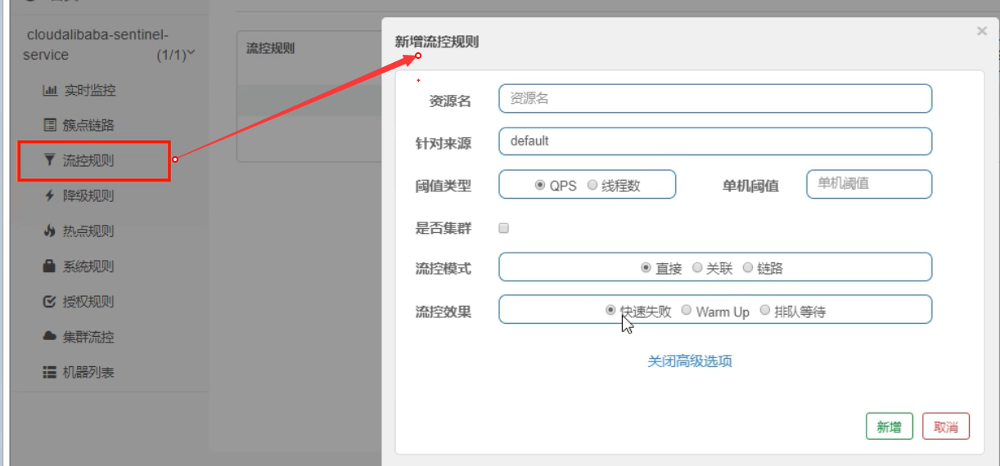
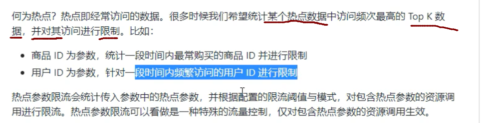
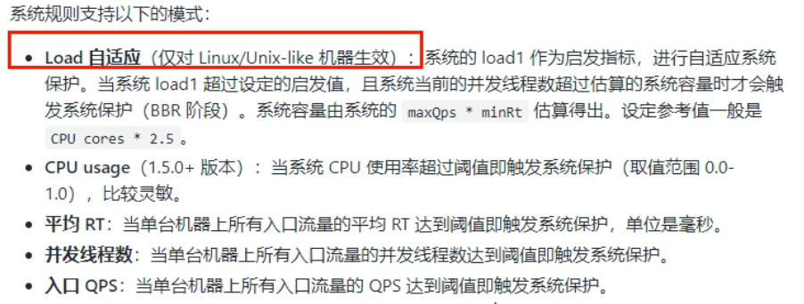

# 1. Spring

## 1.1 谈一下对spring框架的理解

Spring是一个优秀的轻量级框架，由7大模块组成，通过IoC和AOP两大特性实现了对象的解耦，简化后端开发，大大的提高了项目的开发管理与维护。

- **SpringCore：**Spring框架的核心容器，提供了Spring框架的基本的功能，这个模块最主要的是BeanFactory，它使用工厂模式来创建所需要的对象，同时Beanfactory使用IOC的思想，通过读取XML文件的方式来实例化对象。
- **SpringContext：**扩展核心容器，提供了Spring上下文环境，给开发人员提供了有用的服务。
- **SpringAOP**: 采用了面向切面的思想，使Spring框架管理对象支持AOP，同时这个模块也提供了事务管理，可以不依赖具体的EJB组件，就可以将事务管理集成到应用程序中。
- **SpringWeb：**提供了Servlet监听器的Context和Web应用的上下文，同时还集成了一些现有的Web框架，如Struts。
- **SpringORM**: 提供了对现有的ORM框架的支持，例如Hibernate，JDO，Mybatis等。
- **SpringDAO:**提供了对数据访问对象（Data Access Object，DAO）模式和JDBC的支持，把实现业务逻辑和数据库访问的代码实现分离等。
- **SpringWebMVC：**提供了一个构件Web应用程序的MVC实现。

## 1.2 谈一下spring IoC

IoC是控制反转，对象的创建交由spring容器来完成，实现对象之间的解耦。

IoC带来的好处是对象之间的关系便于管理。

IoC原理：反射，根据类的全限定名在程序运行时创建对象，将类的全限定名配置在xml文件中，在程序运行时通过反射读取该类的全限定名，动态的创建对象。

IoC是一种思想，依赖注入(DI)是这种思想的一种具体实现，依赖注入的两种方式：1.构造器注入 2. setter方法注入。

## 1.3 谈一下spring AOP

AOP是面向切面编程，指在程序运行期间将某段代码动态切入到指定方法的指定位置进行运行。

spring AOP的实现原理：动态代理。Spring AOP中的动态代理主要有两种方式，JDK动态代理和CGLIB动态代理。JDK动态代理通过反射

来接收被代理的类，并且要求被代理的类必须实现一个接口。JDK动态代理的核心是<font color='red'>InvocationHandler接口</font>和<font color='red'>Proxy类</font>。

如果目标类没有实现接口，那么Spring AOP会选择使用CGLIB来动态代理目标类。CGLIB（Code Generation Library），是一个代码生

成的类库，可以在运行时动态的生成某个类的子类，CGLIB是通过继承的方式做的动态代理，因此如果某个类被标记为final，那么它是无

法使用CGLIB做动态代理的，诸如private的方法也是不可以作为切面的。

spring AOP的使用场景：日志（审计）、权限控制、安全检查、事务控制。

## 1.4 spring的AOP在自己的项目中具体是怎样运用的？怎么写的？

举例: 项目中对各个方法的调用增加了审计功能（记录谁在什么时间调用了什么方法）该审计功能运用了AOP技术思想，对原有业务逻辑

没有任何侵入影响。

```java
@Aspect
@Component
public class MyAudit{
    
    @Before("execution(* com.huang.service.UserServiceImpl.*(..))") //切点表达式
    public void Audit(){
        //...审计业务逻辑
    }
}
```


## 1.5 spring AOP的顺序？

<font color=red>**spring4和spring5的AOP执行顺序是不一样的**</font>

springboot 2 --> spring 5

springboot1 --> spring 4

@Before 前置通知：目标方法之前执行

@After 后置通知：目标方法之后执行（始终执行）

@AfterReturning 返回后通知 执行方法结束前执行（异常不执行）

@AfterThrowing 异常通知（出现异常时执行）

@Around 环绕通知 （环绕目标方法执行） // around(ProceedingJoinPoint pjp)  --> AAA pjp.process() BBB

<font color=red>spring 4:</font>

正常情况：@Around 前 --> @Before  --> XXX-->@Around 后 -->@After  --> @AfterReturning 

异常情况：@Around 前 -->@Before-->XXX-->@After 后置通知 --> @AfterThrowing

<font color=red>spring 5:</font>

正常情况：@Around 前 --> @Before  --> XXX--> @AfterReturning-->@After -->@Around 后 

异常情况：@Around 前 -->@Before-->XXX --> @AfterThrowing -->@After 

## 1.6 spring是怎么解决循环依赖的？

三级缓存：

```java
public class DefaultSingletonBeanRegistry extends SimpleAliasRegistry implements SingletonBeanRegistry {
    //一级缓存(单例池) 存放已经经历了完整生命周期的Bean对象
    private final Map<String, Object> singletonObjects = new ConcurrentHashMap(256);
    
    //三级缓存 存放可以生产Bean的工厂
    private final Map<String, ObjectFactory<?>> singletonFactories = new HashMap(16);
    
    //二级缓存 存放早期暴露出来的Bean对象，Bean的生命周期未结束(属性还未填充完)
    private final Map<String, Object> earlySingletonObjects = new HashMap(16); 
```

举例：A和B循环依赖

1. A创建过程中需要B，于是A将自己放入三级缓存中，去实例化B。
2. B实例化的时候发现需要A，于是B先查一级缓存，没有，再查二级缓存，还是没有，再查三级缓存，找到A，然后把三级缓存里的A放到二级缓存中，并删除三级缓存里的A。
3. B顺利完成初始化，将自己放入一级缓存里(此时B里的A依然是创建中状态)，然后回来接着创建A，此时B已经创建结束，直接从一级缓存里面拿到B，然后完成创建，并将A自己放到一级缓存里。

spring能解决setter方法注入的循环依赖，不能解决构造方法注入的循环依赖。

默认的单例场景可以解决，原型场景不能解决会报错。

## 1.7 说说spring中bean的生命周期

springbean的生命周期的4个阶段：实例化 --> 属性赋值 --> 初始化 --> 销毁

## 1.8 spring中bean的作用域是什么？

spring bean的作用域默认是单例的。可以通过**scope**属性进行配置。

singleton 、prototype、request、session、application、websocket

## 1.9 spring 的事务注解@Transactional在什么情况下会失效？

@Transational注解只在public的方法上才生效，如果在其他可见度方法上会失效。

## 1.10 谈谈spring的事务传播行为

```java
public void methodA(){
    methodB();
    //dosomething
}

@Transaction(Propagation=xxx)
public void methodB(){
    //dosomething
}
```

spring中7种事务传播行为：

| 事务传播行为类型              | 说明                                                         |
| ----------------------------- | ------------------------------------------------------------ |
| **PROPAGATION_REQUIRED**      | 如果当前没有事务，就创建一个新事务，如果当前存在事务，就加入该事务，该设置是最常用的设置 |
| **PROPAGATION_SUPPORTS**      | 支持当前事务，如果当前存在事务，就加入该事务，如果当前不存在事务，就以非事务执行 |
| **PROPAGATION_MANDATORY**     | 支持当前事务，如果当前存在事务，就加入该事务，如果当前不存在事务，就抛出异常 |
| **PROPAGATION_REQUIRES_NEW**  | 创建新事务，无论当前存不存在事务，都创建新事务               |
| **PROPAGATION_NOT_SUPPORTED** | 以非事务方式执行操作，如果当前存在事务，就把当前事务挂起     |
| **PROPAGATION_NEVER**         | 以非事务方式执行，如果当前存在事务，则抛出异常               |
| **PROPAGATION_NESTED**        | 如果当前存在事务，则在嵌套事务内执行。如果当前没有事务，则执行与PROPAGATION_REQUIRED类似的操作 |

## 1.11谈谈spring事务的隔离级别

**1.首先说明一下事务并发引起的三种情况：**

**1) Dirty Reads 脏读** 
一个事务正在对数据进行更新操作，但是更新还未提交，另一个事务这时也来操作这组数据，并且读取了前一个事务还未提交的数据，而前一个事务如果操作失败进行了回滚，后一个事务读取的就是错误数据，这样就造成了脏读。

**2) Non-Repeatable Reads 不可重复读** 
一个事务多次读取同一数据，在该事务还未结束时，另一个事务也对该数据进行了操作，而且在第一个事务两次次读取之间，第二个事务对数据进行了更新，那么第一个事务前后两次读取到的数据是不同的，这样就造成了不可重复读。

**3) Phantom Reads 幻读** 
第一个数据正在查询符合某一条件的数据，这时，另一个事务又插入了一条符合条件的数据，第一个事务在第二次查询符合同一条件的数据时，发现多了一条前一次查询时没有的数据，仿佛幻觉一样，这就是幻读。

**不可重复读和幻像读的区别：**
不可重复读是指同一查询在同一事务中多次进行，由于其他提交事务所做的修改或删除，每次返回不同的结果集，此时发生非重复读。幻读是指同一查询在同一事务中多次进行，由于其他提交事务所做的插入操作，每次返回不同的结果集，此时发生幻读。表面上看，区别就在于不可重复读能看见其他事务提交的修改和删除，而幻读能看见其他事务提交的插入。

**2.隔离级别：**

**1) DEFAULT （默认）** 
这是一个PlatfromTransactionManager默认的隔离级别，使用数据库默认的事务隔离级别。另外四个与JDBC的隔离级别相对应。

**2) READ_UNCOMMITTED （读未提交）** 
这是事务最低的隔离级别，它允许另外一个事务可以看到这个事务未提交的数据。这种隔离级别会产生脏读，不可重复读和幻像读。 

**3) READ_COMMITTED （读已提交）** 
保证一个事务修改的数据提交后才能被另外一个事务读取，另外一个事务不能读取该事务未提交的数据。这种事务隔离级别可以避免脏读出现，但是可能会出现不可重复读和幻像读。 

**4) REPEATABLE_READ （可重复读）** 
这种事务隔离级别可以防止脏读、不可重复读，但是可能出现幻像读。它除了保证一个事务不能读取另一个事务未提交的数据外，还保证了不可重复读。

**5) SERIALIZABLE（串行化）** 
这是花费最高代价但是最可靠的事务隔离级别，事务被处理为顺序执行。除了防止脏读、不可重复读外，还避免了幻像读。

**隔离级别解决事务并行引起的问题：**

| 隔离级别 | 胀读   | 不可重复读 | 幻读   |
| -------- | ------ | ---------- | ------ |
| 读未提交 | 可能   | 可能       | 可能   |
| 读已提交 | 不可能 | 可能       | 可能   |
| 可重复读 | 不可能 | 不可能     | 可能   |
| 串行化   | 不可能 | 不可能     | 不可能 |

# 2. SpringMVC

## 2.1 说说springMVC的工作流程


# 3. Springboot

## 3.1 谈谈对springboot的理解

springboot简化了spring应用的开发，对spring技术栈有很好的整合。

springboot有两大特性：起步依赖和自动配置：

起步依赖利用传递依赖解析，把常用库聚合在一起，组成为特定功能而定制的依赖，本质上是一个pom 定义了对其他库的传递依赖，这

些东西加起来支持某项功能，避免了手动去处理各个jar包之间的依赖和版本关系。

自动配置功能省去了大量繁琐的xml配置。

## 3.2 怎样创建自己的起步依赖/启动器？

自定义starter:

1，自定义的这个场景需要使用到的依赖是什么？

2，如何编写自动配置

```java
@Configuration //指定类是配置类
@ConditionalOnXXX //在指定条件成立的情况下自动配置生效
@AutoConfigureAfter //指定自动配置类的顺序
@Bean //给容器中添加组件

@ConfigurationProperties //结合相关XXXProperties类来绑定相关配置
@EnableConfigurationProperties //让XXXProperties生效并加入到容器中

//将需要启动就加载的自动配置类配置在META-INF/spring.factories中
//例如：
org.springframework.boot.autoconfigure.EnableAutoConfiguration=\
org.springframework.boot.autoconfigure.admin.SpringApplicationAdminJmxAutoConfiguration,\
org.springframework.boot.autoconfigure.aop.AopAutoConfiguration,\
```

3，编写规则：

- 启动器（starter）模块是一个空的JAR文件，仅提供辅助性依赖管理，这些依赖可能用于自动装配或者其他类库

  启动器只用来做依赖导入，专门写一个自动配置模块，启动器依赖自动配置 只需引入启动器即可

   XXX-starter --> xxx-starter-autoconfigurer

- 命名规约 ：官方spring-boot-starter-模块名   自定义 模块名-spring-boot-starter

例子：


```xml
<?xml version="1.0" encoding="UTF-8"?>
<project xmlns="http://maven.apache.org/POM/4.0.0"
         xmlns:xsi="http://www.w3.org/2001/XMLSchema-instance"
         xsi:schemaLocation="http://maven.apache.org/POM/4.0.0 http://maven.apache.org/xsd/maven-4.0.0.xsd">
    <parent>
        <artifactId>springbootDemo</artifactId>
        <groupId>com.huang</groupId>
        <version>1.0-SNAPSHOT</version>
    </parent>
    <modelVersion>4.0.0</modelVersion>
    <artifactId>huang-spring-boot-starter</artifactId>
    <!-- 自定义启动器 -->
    <!-- 空模块，只用来做依赖导入 -->
    <!-- 引入自定义启动模块 -->
    <dependencies>
        <dependency>
            <groupId>com.huang</groupId>
            <artifactId>huang-spring-boot-starter-autoconfigurer</artifactId>
            <version>0.0.1-SNAPSHOT</version>
        </dependency>
    </dependencies>
</project>
```


```xml
<?xml version="1.0" encoding="UTF-8"?>
<project xmlns="http://maven.apache.org/POM/4.0.0" xmlns:xsi="http://www.w3.org/2001/XMLSchema-instance"
	xsi:schemaLocation="http://maven.apache.org/POM/4.0.0 https://maven.apache.org/xsd/maven-4.0.0.xsd">
	<modelVersion>4.0.0</modelVersion>
	<parent>
		<groupId>org.springframework.boot</groupId>
		<artifactId>spring-boot-starter-parent</artifactId>
		<version>2.2.10.RELEASE</version>
		<relativePath/> <!-- lookup parent from repository -->
	</parent>
	<groupId>com.huang</groupId>
	<artifactId>huang-spring-boot-starter-autoconfigurer</artifactId>
	<version>0.0.1-SNAPSHOT</version>
	<name>huang-spring-boot-starter-autoconfigurer</name>
	<description>Demo project for Spring Boot</description>
    <!-- 自定义启动器的自动配置模块 -->
	<properties>
		<java.version>1.8</java.version>
	</properties>
	<dependencies>
        <!-- 放入所有需要的依赖-->
		<dependency>
			<groupId>org.springframework.boot</groupId>
			<artifactId>spring-boot-starter</artifactId>
		</dependency>
		<dependency>
			<groupId>org.springframework.boot</groupId>
			<artifactId>spring-boot-configuration-processor</artifactId>
			<optional>true</optional>
		</dependency>
	</dependencies>
</project>
```

```java
@Configuration
@ConditionalOnWebApplication //web应用才生效
@EnableConfigurationProperties(HelloProperties.class)
public class HelloServiceAutoConfiguration {
    @Autowired
    HelloProperties helloProperties;
    
    @Bean
    public HelloService helloService(){
        HelloService helloService = new HelloService();
        helloService.setHelloProperties(helloProperties);
        return helloService;
    }
}
```

```java
public class HelloService {

    HelloProperties helloProperties;

    public HelloProperties getHelloProperties() {
        return helloProperties;
    }
    public void setHelloProperties(HelloProperties helloProperties) {
        this.helloProperties = helloProperties;
    }
    public String sayHello(String name){
        return helloProperties.getPrefix()+","+name+","+helloProperties.getSuffix();
    }
}
```

```java
@ConfigurationProperties(prefix = "huang.hello")
public class HelloProperties {
    private String prefix;
    private String suffix;
   //setter getter...
}
```

```pr
## spring.factories
org.springframework.boot.autoconfigure.EnableAutoConfiguration=\
com.huang.starter.HelloServiceAutoConfiguration
```


## 3.3 springboot自动配置的原理？

springboot自动配置原理：

@springbootApplication = @EnableAutoConfiguration +  @springbootConfiguration + @Componetscan

@EnableAutoConfiguration(开启自动配置功能):

 在类路径下META-INF/spring.factories中获取xxxEnableAutoConfiguration指定的值导入@xxxAutoConfiguration标注的bean：

1.springboot启动时加载主配置类，开启自动配置功能@EnableAutoConfiguration

2.@EnableAutoConfiguration作用：利用EnableAutoConfigurationImportSelector给容器导入一系列组件：

扫描所有jar包类路径下MEAT-INF/spring.factories,把扫描到的文件内容包装成properties对象，从properties中获取到

EnableAutoConfiguration.class类（类名）对应的值，然后把它们添加到容器中，将类路径下MEAT-INF/spring.factories里面

配置的所有EnableAutoConfigurtion的值加入到容器中。


# 4. Springcloud

## 4.1 谈谈对springcloud的理解

springcloud是在springboot基础上构建的用于快速构建分布式系统的通用工具集，组件丰富功能齐全,为微服务架构提供了

非常完整的支持，例如注册中心、配置管理、服务发现、断路器、网关等。

## 4.2 用过springcloud的哪些组件？分别有什么作用？


**服务注册中心：**

<font color=red>Netflix Eureka:</font>服务注册中心，服务注册与发现（官网已停更）

Eureka包含两个组件：Eureka server和Eureka client

Eureka server提供服务发现功能，各个微服务启动时会向Eureka server注册自己的信息（ip,端口，微服务名称）

Eureka client是一个java客户端用于简化与Eureka server的交互

@EnableEurekaServer

@EnableEurekaClient

Eureka集群的实现：Eureka server相互注册

Eureka client会缓存服务注册表中的信息，微服务无需每次请求都查询Eureka server从而降低Eureka server压力，即使Eureka server所

有节点都宕掉，服务消费者依然可以使用缓存中的信息，找到服务提供者并完成调用。


<font color=red>zookeeper:</font> 作为注册中心：

```xml
<!-- SpringBoot整合zookeeper客户端 -->
 <dependency>
    <groupId>org.springframework.cloud</groupId>
    <artifactId>spring-cloud-starter-zookeeper-discovery</artifactId>
 </dependency>
```


```yml
#服务别名----注册zookeeper到注册中心名称
spring:
  application:
    name: cloud-provider-payment
  cloud:
    zookeeper:
      connect-string: 192.168.111.144:2181
```

微服务注册进zookeeper作为一个节点：临时节点

<font color=red>Consul：</font>一套开源的分布式服务发现和配置管理系统，用GO语言开发

<font color=red>Alibaba Nacos:</font>  Nacos = Eureka + Config + Bus

**服务调用：**

<font color=red>Ribbon：</font>

本地负载均衡客户端，进程内Load Balance

负载均衡，服务调用(Ribbon+restTemplate)，实现客户端侧负载均衡（高版本的Eureka client自带Ribbon）

Ribbon的核心组件IRule:

Ribbon自带负载规则：

1. 轮询：RoundRobinRule

2. 随机：RandomRule

3. 先轮询，失败重试：RetryRule

4. …

替换ribbon负载规则：

@Configuration

Public class MyRule{

 @Bean

 Public IRule myRule(){

 Return new RandomRule(); //返回特定规则

}

}

@RibbonClient(name=“微服务名”，Configruation=MyselfRule.Class)

主启动类{…}


<font color=red>openFeign：</font>

申明式的服务调用，模板化的http客户端，可更便捷优雅地调用http api

Feign是一个申明式web服务客户端，让编写web服务端变得非常容易，只需要创建一个接口并在接口上添加注解即可

Feign集成了ribbon

```java
@EnableFeignClient
@FeignClient(value=“微服务名称”)
```

openFeign的超时控制：

ribbon:

 ReadTimeout: 5000 //建立连接时间

 ConnectTime: 5000 //建立连接后从服务器读到可用资源所用时间

Feign的日志级别：

```yml
logging:
  level:
    com.huang….paymentFeignService: debug
```

****

**服务降级：**

<font color=red>Hystrix:</font>

微服务容错处理，hystrix是一个延迟和容错库，用于隔离访问远程系统服务或第三方库，防止级联失败，从而提高系统可用性与容错性，实现了超时机制和断路器模式

后备处理：fallbackMethod=””

雪崩效应：
 “基础服务故障”导致“级联故障”的现象称为雪崩效应，雪崩效应描述的是提供者不可用导致消费者不可用，并将不可用逐渐放大的过程，防止雪崩效应必须有一个强大的容错机制，该机制需实现：1.为网络请求设置超时。2.使用断路器模式（1.实现快速失败 2.自动诊断依赖的服务是否恢复正常）


Hystrix主要通过以下几点实现延迟和容错： 

1. 包裹请求：使用HystrixCommand(或HystrixObservableCommand)包裹对依赖的调用逻辑，每个命令在独立线程中执行，这使用了设计模式中的命令模式

2. 跳闸机制：当某服务的错误率超过一定阈值时，Hystix可以自动或手动跳闸，停止请求该服务一段时间

3. 资源隔离：Hystrix为每个依赖都维护了一个小型的线程池（或信号量）如果该线程池已满，发往该依赖的请求就立即拒绝，而不是排队等候，从而加速失败判定

4. 监控：Hystrix可以近乎实时地监控运行指标和配置变化，例如成功，失败，超时和被拒绝的请求等。

5. 回退机制：当请求失败，超时，被拒绝或当断路器打开时，执行回退逻辑，回退逻辑可由开发人员自行提供，例如返回一个缺省值

6. 自我修复：断路器打开一段时间后，会进入“半开”状态

 Hystrix断路器的状态监控：断路器的状态会暴露在Actuator提供的/health端点中

 <font color=red>执行回退逻辑并不代表断路器已经打开，请求失败，超时，被拒绝以及断路器打开时都会执行回退逻辑</font>

<font color=red>失败率达到阈值（默认5秒内20次失败）才会打开断路器</font>

Hystrix隔离策略：1.线程隔离 2.信号量隔离

THREAD(线程隔离)：使用该方式，HystrixCommand将在单独的线程上执行，并发请求受到线程池中的线程数量的限制

SEMAPHORE(信号量隔离)：使用该方式，HystrixCommand将在调用线程上执行，开销相对较小，并发请求受到信号量个数的限制

CommandProperties={

 “execution.isolation.strategy” value=“SEMAPHORE”

} 

服务熔断：

@HystrixCommand(fallbackMethod=”xxx”, commandProperties={

@HystrixProperty(name=”circuitBreaker.enable”value=”true”)//开关

@HystrixProperty(name=”circuitBreaker.requestvolumeThreshold”value=”10”) //请求次数

@HystrixProperty(name=”circuitBreaker.sleepwindownInMillseconds”value=”1000” //时间窗口期

@HystrixProperty(name=”circuitBreaker.errorThresholdPercentage”value=”60”) //失败率达到多少后跳闸

}

)

<font color=red>Sentinel:</font> 实现熔断与限流


1.sentinel的流控规则

流量限制控制规则





2.降级规则:

**就是熔断降级**


3.热点规则:


​	


**使用@SentinelResource直接实现降级方法,它等同Hystrix的@HystrixCommand**


4,系统规则:

系统自适应限流:
			从整体维度对应用入口进行限流

对整体限流,比如设置qps到达100,这里限流会限制整个系统不可以

**





sentinel持久化规则

默认规则是临时存储的,重启sentinel就会消失


**这里以之前的8401为案例进行修改:**

1. 修改8401的pom

   ```xml
   添加:
   <!-- SpringCloud ailibaba sentinel-datasource-nacos 持久化需要用到-->
   <dependency>
       <groupId>com.alibaba.csp</groupId>
       <artifactId>sentinel-datasource-nacos</artifactId>
   </dependency>
    
   ```

   

2. 修改配置文件:

   添加:

    

    


**服务配置：**

<font color=red>Config</font>

统一管理微服务配置，spring cloud config为微服务架构中的微服务提供集中化的外部配置支持，配置服务器为各个不同微服务应用的所有环境提供了一个中心化的外部配置


<font color=red>Nacos:</font> Nacos也可以作为服务配置中心

**服务网关：**

<font color=red>Zuul</font>

微服务网关，介于客户端和服务端之间的中间层，所有的外部请求都会先经过微服务网关

Zuul的核心是一系列过滤器

@EnableZuulProxy

将一个zuul网关注册到Eureka上，在默认情况下zuul会代理所有注册到Eureka server上的微服务，并且zuul的路由规则如下：

http://zuul-host:zuulport/微服务在Eureka上的serviceId/xx 会被转发到serviceId对应的微服务

zuul的过滤器（4种类型）

1.Pre: 被路由之前调用

2.Routing:将请求路由到微服务

3.Post:路由到微服务后执行

4.Error:在其他阶段发生错误时执行


 


<font color=red>GateWay:</font>

Spring cloud GateWay 新一代网关 spring社区自研 zuul 1.x的替代，使用非阻塞api

Spring cloud gateway三大核心概念：

1. 路由： Route 构建网关的基本模块由id,目标uri一系列断言过滤器组成，如断言为true则匹配该路由

2. 断言：predicate 如果请求与断言相匹配则进行路由

3. 过滤器：spring框架中gatewayFilter的实例，使用过滤器可以在请求被路由前或后对请求进行修改。

 <font color='red'>网关限流？？？？</font>

**消息总线：**

<font color=red>Bus消息总线:</font>  spring cloud Bus是将分布式系统的节点与轻量级消息系统链接起来的框架，整合了java的事件处理机制和消息中间件的功

能

**消息驱动：**

<font color=red>消息驱动:</font>  Stream

屏蔽底层消息中间件的差异，降低切换成本，统一消息的编程模型。（目前只支持RabbitMQ, kafka）

<font color=red>spring cloud stream是怎么屏蔽底层差异的？</font>

在没有绑定器概念的情况下，springboot应用要直接与消息中间件进行信息交互，

通过定义绑定器作为中间层，实现了应用程序与消息中间件细节之间的隔离，通过向应用程序暴露统一的Channel通道，使应用程序不需要再考虑各种不同的消息中间件实现。

通过定义绑定器Binder作为中间层，实现了应用程序与消息中间件细节之间的隔离。

Binder:

​     input -->对应于消费者

​    output-->对应与生产者

## 4.3 几个注册中心的区别？(Eureka, Zookeeper, Consul)


## 4.4 谈一下分布式系统中的CAP理论

一个分布式系统不可能同时满足一致性(C)、高可用性(A)、分区容错性(P)这三个需求。

## 4.5 说一下Eureka的自我保护机制

<font color='red'>Eureka自我保护机制</font>：（一种应对网络异常的安全保护措施）

Eureka server节点在短时间内丢失过多客户端时（可能发生网络分区故障），该节点会自动进入自我保护模式，一旦进入该模式Eureka server就会保护服务注册表中的信息，不再删除服务注册表中的数据（也就是不会注销任何微服务），当网络故障恢复后，该Eureka server节点会自动退出自我保护模式。

