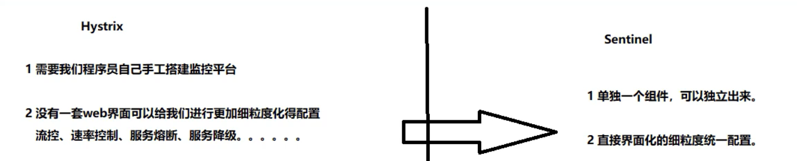
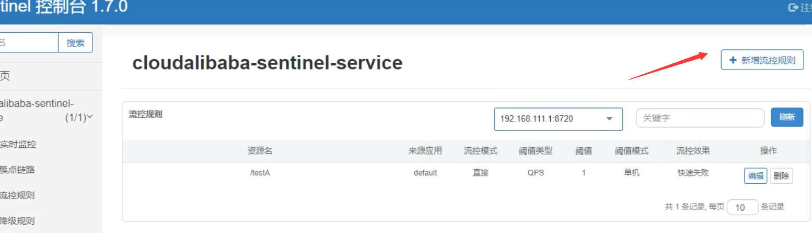
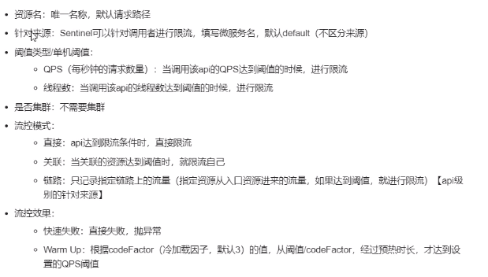
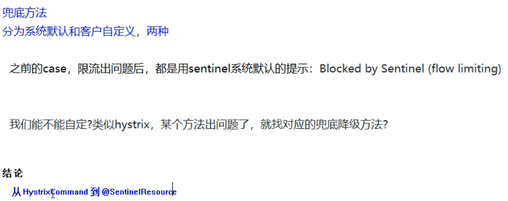
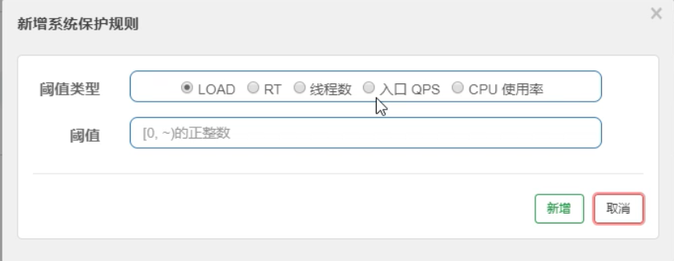

# 1. Spring

## 1.1 谈一下对spring框架的理解

Spring是一个优秀的轻量级框架，由7大模块组成，通过IoC和AOP两大特性实现了对象的解耦，简化后端开发，大大的提高了项目的开发管理与维护效率。

- **SpringCore：**Spring框架的核心容器，提供了Spring框架的基本的功能，这个模块最主要的是BeanFactory，它使用工厂模式来创建所需要的对象，同时Beanfactory使用IOC的思想，通过读取XML文件的方式来实例化对象。
- **SpringContext：**扩展核心容器，提供了Spring上下文环境，给开发人员提供了有用的服务。
- **SpringAOP**: 采用了面向切面的思想，使Spring框架管理对象支持AOP，同时这个模块也提供了事务管理，可以不依赖具体的EJB组件，就可以将事务管理集成到应用程序中。
- **SpringWeb：**提供了Servlet监听器的Context和Web应用的上下文，同时还集成了一些现有的Web框架，如Struts。
- **SpringORM**: 提供了对现有的ORM框架的支持，例如Hibernate，JDO，Mybatis等。
- **SpringDAO:**提供了对数据访问对象（Data Access Object，DAO）模式和JDBC的支持，把实现业务逻辑和数据库访问的代码实现分离等。
- **SpringWebMVC：**提供了一个构建Web应用程序的MVC实现。

## 1.2 谈一下spring IoC

IoC是控制反转，对象的创建交由spring容器来完成，实现对象之间的解耦。

IoC带来的好处是对象之间的关系便于管理。

IoC原理：反射，根据类的全限定名在程序运行时创建对象，将类的全限定名配置在xml文件中，在程序运行时通过反射读取该类的全限定名，动态的创建对象。

IoC是一种思想，依赖注入(DI)是这种思想的一种具体实现，依赖注入的两种方式：1.构造器注入 2. setter方法注入。

## 1.3 谈一下spring AOP

AOP是面向切面编程，指在程序运行期间将某段代码动态切入到指定方法的指定位置进行运行。

spring AOP的实现原理：动态代理。Spring AOP中的动态代理主要有两种方式，JDK动态代理和CGLIB动态代理。JDK动态代理通过反射

来接收被代理的类，并且要求被代理的类必须实现一个接口。JDK动态代理的核心是<font color='red'>InvocationHandler接口</font>和<font color='red'>Proxy类</font>。

如果目标类没有实现接口，那么Spring AOP会选择使用CGLIB来动态代理目标类。CGLIB（Code Generation Library），是一个代码生

成的类库，可以在运行时动态的生成某个类的子类，CGLIB是通过继承的方式做的动态代理，因此如果某个类被标记为final，那么它是无

法使用CGLIB做动态代理的，诸如private的方法也是不可以作为切面的。

spring AOP的使用场景：日志（审计）、权限控制、安全检查、事务控制。

## 1.4 spring的AOP在自己的项目中具体是怎样运用的？怎么写的？

举例: 项目中对各个方法的调用增加了审计功能（记录谁在什么时间调用了什么方法）该审计功能运用了AOP技术思想，对原有业务逻辑

没有任何侵入影响。

```java
@Aspect
@Component
public class MyAudit{
    
    @Before("execution(* com.huang.service.UserServiceImpl.*(..))") //切点表达式
    public void Audit(){
        //...审计业务逻辑
    }
}
```


## 1.5 spring AOP的顺序？

<font color=red>**spring4和spring5的AOP执行顺序是不一样的**</font>

springboot 2 --> spring 5

springboot1 --> spring 4

@Before 前置通知：目标方法之前执行

@After 后置通知：目标方法之后执行（始终执行）

@AfterReturning 返回后通知 执行方法结束前执行（异常不执行）

@AfterThrowing 异常通知（出现异常时执行）

@Around 环绕通知 （环绕目标方法执行） // around(ProceedingJoinPoint pjp)  --> AAA pjp.process() BBB

<font color=red>spring 4:</font>

正常情况：@Around 前 --> @Before  --> XXX-->@Around 后 -->@After  --> @AfterReturning 

异常情况：@Around 前 -->@Before-->XXX-->@After 后置通知 --> @AfterThrowing

<font color=red>spring 5:</font>

正常情况：@Around 前 --> @Before  --> XXX--> @AfterReturning-->@After -->@Around 后 

异常情况：@Around 前 -->@Before-->XXX --> @AfterThrowing -->@After 

## 1.6 spring是怎么解决循环依赖的？

三级缓存：

```java
public class DefaultSingletonBeanRegistry extends SimpleAliasRegistry implements SingletonBeanRegistry {
    //一级缓存(单例池) 存放已经经历了完整生命周期的Bean对象
    private final Map<String, Object> singletonObjects = new ConcurrentHashMap(256);
    
    //三级缓存 存放可以生产Bean的工厂
    private final Map<String, ObjectFactory<?>> singletonFactories = new HashMap(16);
    
    //二级缓存 存放早期暴露出来的Bean对象，Bean的生命周期未结束(属性还未填充完)
    private final Map<String, Object> earlySingletonObjects = new HashMap(16); 
```

举例：A和B循环依赖

1. A创建过程中需要B，于是A将自己放入三级缓存中，去实例化B。
2. B实例化的时候发现需要A，于是B先查一级缓存，没有，再查二级缓存，还是没有，再查三级缓存，找到A，然后把三级缓存里的A放到二级缓存中，并删除三级缓存里的A。
3. B顺利完成初始化，将自己放入一级缓存里(此时B里的A依然是创建中状态)，然后回来接着创建A，此时B已经创建结束，直接从一级缓存里面拿到B，然后完成创建，并将A自己放到一级缓存里。

spring能解决setter方法注入的循环依赖，不能解决构造方法注入的循环依赖。

默认的单例场景可以解决，原型场景不能解决会报错。

## 1.7 说说spring中bean的生命周期

springbean的生命周期的4个阶段：实例化 --> 属性赋值 --> 初始化 --> 销毁

## 1.8 spring中bean的作用域是什么？

spring bean的作用域默认是单例的。可以通过**scope**属性进行配置。

singleton 、prototype、request、session、application、websocket

## 1.9 spring 的事务注解@Transactional在什么情况下会失效？

@Transational注解只在public的方法上才生效，如果在其他可见度方法上会失效。

## 1.10 谈谈spring的事务传播行为

```java
public void methodA(){
    methodB();
    //dosomething
}

@Transaction(Propagation=xxx)
public void methodB(){
    //dosomething
}
```

spring中7种事务传播行为：

| 事务传播行为类型              | 说明                                                         |
| ----------------------------- | ------------------------------------------------------------ |
| **PROPAGATION_REQUIRED**      | 如果当前没有事务，就创建一个新事务，如果当前存在事务，就加入该事务，该设置是最常用的设置 |
| **PROPAGATION_SUPPORTS**      | 支持当前事务，如果当前存在事务，就加入该事务，如果当前不存在事务，就以非事务执行 |
| **PROPAGATION_MANDATORY**     | 支持当前事务，如果当前存在事务，就加入该事务，如果当前不存在事务，就抛出异常 |
| **PROPAGATION_REQUIRES_NEW**  | 创建新事务，无论当前存不存在事务，都创建新事务               |
| **PROPAGATION_NOT_SUPPORTED** | 以非事务方式执行操作，如果当前存在事务，就把当前事务挂起     |
| **PROPAGATION_NEVER**         | 以非事务方式执行，如果当前存在事务，则抛出异常               |
| **PROPAGATION_NESTED**        | 如果当前存在事务，则在嵌套事务内执行。如果当前没有事务，则执行与PROPAGATION_REQUIRED类似的操作 |

## 1.11谈谈spring事务的隔离级别

**1.首先说明一下事务并发引起的三种情况：**

**1) Dirty Reads 脏读** 
一个事务正在对数据进行更新操作，但是更新还未提交，另一个事务这时也来操作这组数据，并且读取了前一个事务还未提交的数据，而前一个事务如果操作失败进行了回滚，后一个事务读取的就是错误数据，这样就造成了脏读。

**2) Non-Repeatable Reads 不可重复读** 
一个事务多次读取同一数据，在该事务还未结束时，另一个事务也对该数据进行了操作，而且在第一个事务两次次读取之间，第二个事务对数据进行了更新，那么第一个事务前后两次读取到的数据是不同的，这样就造成了不可重复读。

**3) Phantom Reads 幻读** 
第一个数据正在查询符合某一条件的数据，这时，另一个事务又插入了一条符合条件的数据，第一个事务在第二次查询符合同一条件的数据时，发现多了一条前一次查询时没有的数据，仿佛幻觉一样，这就是幻读。

**不可重复读和幻像读的区别：**
不可重复读是指同一查询在同一事务中多次进行，由于其他提交事务所做的修改或删除，每次返回不同的结果集，此时发生非重复读。幻读是指同一查询在同一事务中多次进行，由于其他提交事务所做的插入操作，每次返回不同的结果集，此时发生幻读。表面上看，区别就在于不可重复读能看见其他事务提交的修改和删除，而幻读能看见其他事务提交的插入。

**2.隔离级别：**

**1) DEFAULT （默认）** 
这是一个PlatfromTransactionManager默认的隔离级别，使用数据库默认的事务隔离级别。另外四个与JDBC的隔离级别相对应。

**2) READ_UNCOMMITTED （读未提交）** 
这是事务最低的隔离级别，它允许另外一个事务可以看到这个事务未提交的数据。这种隔离级别会产生脏读，不可重复读和幻像读。 

**3) READ_COMMITTED （读已提交）** 
保证一个事务修改的数据提交后才能被另外一个事务读取，另外一个事务不能读取该事务未提交的数据。这种事务隔离级别可以避免脏读出现，但是可能会出现不可重复读和幻像读。 

**4) REPEATABLE_READ （可重复读）** 
这种事务隔离级别可以防止脏读、不可重复读，但是可能出现幻像读。它除了保证一个事务不能读取另一个事务未提交的数据外，还保证了不可重复读。

**5) SERIALIZABLE（串行化）** 
这是花费最高代价但是最可靠的事务隔离级别，事务被处理为顺序执行。除了防止脏读、不可重复读外，还避免了幻像读。

**隔离级别解决事务并行引起的问题：**

| 隔离级别 | 胀读   | 不可重复读 | 幻读   |
| -------- | ------ | ---------- | ------ |
| 读未提交 | 可能   | 可能       | 可能   |
| 读已提交 | 不可能 | 可能       | 可能   |
| 可重复读 | 不可能 | 不可能     | 可能   |
| 串行化   | 不可能 | 不可能     | 不可能 |

# 2. SpringMVC

## 2.1 说说springMVC的工作流程


# 3. Springboot

## 3.1 谈谈对springboot的理解

springboot简化了spring应用的开发，对spring技术栈有很好的整合。

springboot有两大特性：起步依赖和自动配置：

起步依赖利用传递依赖解析，把常用库聚合在一起，组成为特定功能而定制的依赖，本质上是一个pom 定义了对其他库的传递依赖，这

些东西加起来支持某项功能，避免了手动去处理各个jar包之间的依赖和版本关系。

自动配置功能省去了大量繁琐的xml配置。

## 3.2 怎样创建自己的起步依赖/启动器？

自定义starter:

1，自定义的这个场景需要使用到的依赖是什么？

2，如何编写自动配置

```java
@Configuration //指定类是配置类
@ConditionalOnXXX //在指定条件成立的情况下自动配置生效
@AutoConfigureAfter //指定自动配置类的顺序
@Bean //给容器中添加组件

@ConfigurationProperties //结合相关XXXProperties类来绑定相关配置
@EnableConfigurationProperties //让XXXProperties生效并加入到容器中

//将需要启动就加载的自动配置类配置在META-INF/spring.factories中
//例如：
org.springframework.boot.autoconfigure.EnableAutoConfiguration=\
org.springframework.boot.autoconfigure.admin.SpringApplicationAdminJmxAutoConfiguration,\
org.springframework.boot.autoconfigure.aop.AopAutoConfiguration,\
```

3，编写规则：

- 启动器（starter）模块是一个空的JAR文件，仅提供辅助性依赖管理，这些依赖可能用于自动装配或者其他类库

  启动器只用来做依赖导入，专门写一个自动配置模块，启动器依赖自动配置 只需引入启动器即可

   XXX-starter --> xxx-starter-autoconfigurer

- 命名规约 ：官方spring-boot-starter-模块名   自定义 模块名-spring-boot-starter

例子：


```xml
<?xml version="1.0" encoding="UTF-8"?>
<project xmlns="http://maven.apache.org/POM/4.0.0"
         xmlns:xsi="http://www.w3.org/2001/XMLSchema-instance"
         xsi:schemaLocation="http://maven.apache.org/POM/4.0.0 http://maven.apache.org/xsd/maven-4.0.0.xsd">
    <parent>
        <artifactId>springbootDemo</artifactId>
        <groupId>com.huang</groupId>
        <version>1.0-SNAPSHOT</version>
    </parent>
    <modelVersion>4.0.0</modelVersion>
    <artifactId>huang-spring-boot-starter</artifactId>
    <!-- 自定义启动器 -->
    <!-- 空模块，只用来做依赖导入 -->
    <!-- 引入自定义启动模块 -->
    <dependencies>
        <dependency>
            <groupId>com.huang</groupId>
            <artifactId>huang-spring-boot-starter-autoconfigurer</artifactId>
            <version>0.0.1-SNAPSHOT</version>
        </dependency>
    </dependencies>
</project>
```


```xml
<?xml version="1.0" encoding="UTF-8"?>
<project xmlns="http://maven.apache.org/POM/4.0.0" xmlns:xsi="http://www.w3.org/2001/XMLSchema-instance"
	xsi:schemaLocation="http://maven.apache.org/POM/4.0.0 https://maven.apache.org/xsd/maven-4.0.0.xsd">
	<modelVersion>4.0.0</modelVersion>
	<parent>
		<groupId>org.springframework.boot</groupId>
		<artifactId>spring-boot-starter-parent</artifactId>
		<version>2.2.10.RELEASE</version>
		<relativePath/> <!-- lookup parent from repository -->
	</parent>
	<groupId>com.huang</groupId>
	<artifactId>huang-spring-boot-starter-autoconfigurer</artifactId>
	<version>0.0.1-SNAPSHOT</version>
	<name>huang-spring-boot-starter-autoconfigurer</name>
	<description>Demo project for Spring Boot</description>
    <!-- 自定义启动器的自动配置模块 -->
	<properties>
		<java.version>1.8</java.version>
	</properties>
	<dependencies>
        <!-- 放入所有需要的依赖-->
		<dependency>
			<groupId>org.springframework.boot</groupId>
			<artifactId>spring-boot-starter</artifactId>
		</dependency>
		<dependency>
			<groupId>org.springframework.boot</groupId>
			<artifactId>spring-boot-configuration-processor</artifactId>
			<optional>true</optional>
		</dependency>
	</dependencies>
</project>
```

```java
@Configuration
@ConditionalOnWebApplication //web应用才生效
@EnableConfigurationProperties(HelloProperties.class)
public class HelloServiceAutoConfiguration {
    @Autowired
    HelloProperties helloProperties;
    
    @Bean
    public HelloService helloService(){
        HelloService helloService = new HelloService();
        helloService.setHelloProperties(helloProperties);
        return helloService;
    }
}
```

```java
public class HelloService {

    HelloProperties helloProperties;

    public HelloProperties getHelloProperties() {
        return helloProperties;
    }
    public void setHelloProperties(HelloProperties helloProperties) {
        this.helloProperties = helloProperties;
    }
    public String sayHello(String name){
        return helloProperties.getPrefix()+","+name+","+helloProperties.getSuffix();
    }
}
```

```java
@ConfigurationProperties(prefix = "huang.hello")
public class HelloProperties {
    private String prefix;
    private String suffix;
   //setter getter...
}
```

```pr
## spring.factories
org.springframework.boot.autoconfigure.EnableAutoConfiguration=\
com.huang.starter.HelloServiceAutoConfiguration
```


## 3.3 springboot自动配置的原理？

springboot自动配置原理：

@springbootApplication = @EnableAutoConfiguration +  @springbootConfiguration + @Componetscan

@EnableAutoConfiguration(开启自动配置功能):

 在类路径下META-INF/spring.factories中获取xxxEnableAutoConfiguration指定的值导入@xxxAutoConfiguration标注的bean：

1.springboot启动时加载主配置类，开启自动配置功能@EnableAutoConfiguration

2.@EnableAutoConfiguration作用：利用EnableAutoConfigurationImportSelector给容器导入一系列组件：

扫描所有jar包类路径下MEAT-INF/spring.factories,把扫描到的文件内容包装成properties对象，从properties中获取到

EnableAutoConfiguration.class类（类名）对应的值，然后把它们添加到容器中，将类路径下MEAT-INF/spring.factories里面

配置的所有EnableAutoConfigurtion的值加入到容器中。


# 4. Springcloud

## 4.1 谈谈对springcloud的理解

springcloud是在springboot基础上构建的用于快速构建分布式系统的通用工具集，组件丰富功能齐全,为微服务架构提供了

非常完整的支持，例如注册中心、配置管理、服务发现、断路器、网关等。

## 4.2 用过springcloud的哪些组件？分别有什么作用？


**服务注册中心：**

<font color=red>Netflix Eureka:</font>服务注册中心，服务注册与发现（官网已停更）

Eureka包含两个组件：Eureka server和Eureka client

Eureka server提供服务发现功能，各个微服务启动时会向Eureka server注册自己的信息（ip,端口，微服务名称）

Eureka client是一个java客户端用于简化与Eureka server的交互

@EnableEurekaServer

@EnableEurekaClient

Eureka集群的实现：Eureka server相互注册

Eureka client会缓存服务注册表中的信息，微服务无需每次请求都查询Eureka server从而降低Eureka server压力，即使Eureka server所

有节点都宕掉，服务消费者依然可以使用缓存中的信息，找到服务提供者并完成调用。


<font color=red>zookeeper:</font> 作为注册中心：

```xml
<!-- SpringBoot整合zookeeper客户端 -->
 <dependency>
    <groupId>org.springframework.cloud</groupId>
    <artifactId>spring-cloud-starter-zookeeper-discovery</artifactId>
 </dependency>
```


```yml
#服务别名----注册zookeeper到注册中心名称
spring:
  application:
    name: cloud-provider-payment
  cloud:
    zookeeper:
      connect-string: 192.168.111.144:2181
```

微服务注册进zookeeper作为一个节点：临时节点

<font color=red>Consul：</font>一套开源的分布式服务发现和配置管理系统，用GO语言开发

<font color=red>Alibaba Nacos:</font>  Nacos = Eureka + Config + Bus

**服务调用：**

<font color=red>Ribbon：</font>

本地负载均衡客户端，进程内Load Balance

负载均衡，服务调用(Ribbon+restTemplate)，实现客户端侧负载均衡（高版本的Eureka client自带Ribbon）

Ribbon的核心组件IRule:

Ribbon自带负载规则：

1. 轮询：RoundRobinRule

2. 随机：RandomRule

3. 先轮询，失败重试：RetryRule

4. …

替换ribbon负载规则：

@Configuration

Public class MyRule{

 @Bean

 Public IRule myRule(){

 Return new RandomRule(); //返回特定规则

}

}

@RibbonClient(name=“微服务名”，Configruation=MyselfRule.Class)

主启动类{…}


<font color=red>openFeign：</font>

申明式的服务调用，模板化的http客户端，可更便捷优雅地调用http api

Feign是一个申明式web服务客户端，让编写web服务端变得非常容易，只需要创建一个接口并在接口上添加注解即可

Feign集成了ribbon

```java
@EnableFeignClient
@FeignClient(value=“微服务名称”)
```

openFeign的超时控制：

ribbon:

 ReadTimeout: 5000 //建立连接时间

 ConnectTime: 5000 //建立连接后从服务器读到可用资源所用时间

Feign的日志级别：

```yml
logging:
  level:
    com.huang….paymentFeignService: debug
```

****

**服务降级：**

<font color=red>Hystrix:</font>

微服务容错处理，hystrix是一个延迟和容错库，用于隔离访问远程系统服务或第三方库，防止级联失败，从而提高系统可用性与容错性，实现了超时机制和断路器模式

后备处理：fallbackMethod=””

雪崩效应：
 “基础服务故障”导致“级联故障”的现象称为雪崩效应，雪崩效应描述的是提供者不可用导致消费者不可用，并将不可用逐渐放大的过程，防止雪崩效应必须有一个强大的容错机制，该机制需实现：1.为网络请求设置超时。2.使用断路器模式（1.实现快速失败 2.自动诊断依赖的服务是否恢复正常）


Hystrix主要通过以下几点实现延迟和容错： 

1. 包裹请求：使用HystrixCommand(或HystrixObservableCommand)包裹对依赖的调用逻辑，每个命令在独立线程中执行，这使用了设计模式中的命令模式

2. 跳闸机制：当某服务的错误率超过一定阈值时，Hystix可以自动或手动跳闸，停止请求该服务一段时间

3. 资源隔离：Hystrix为每个依赖都维护了一个小型的线程池（或信号量）如果该线程池已满，发往该依赖的请求就立即拒绝，而不是排队等候，从而加速失败判定

4. 监控：Hystrix可以近乎实时地监控运行指标和配置变化，例如成功，失败，超时和被拒绝的请求等。

5. 回退机制：当请求失败，超时，被拒绝或当断路器打开时，执行回退逻辑，回退逻辑可由开发人员自行提供，例如返回一个缺省值

6. 自我修复：断路器打开一段时间后，会进入“半开”状态

 Hystrix断路器的状态监控：断路器的状态会暴露在Actuator提供的/health端点中

 <font color=red>执行回退逻辑并不代表断路器已经打开，请求失败，超时，被拒绝以及断路器打开时都会执行回退逻辑</font>

<font color=red>失败率达到阈值（默认5秒内20次失败）才会打开断路器</font>

Hystrix隔离策略：1.线程隔离 2.信号量隔离

THREAD(线程隔离)：使用该方式，HystrixCommand将在单独的线程上执行，并发请求受到线程池中的线程数量的限制

SEMAPHORE(信号量隔离)：使用该方式，HystrixCommand将在调用线程上执行，开销相对较小，并发请求受到信号量个数的限制

CommandProperties={

 “execution.isolation.strategy” value=“SEMAPHORE”

} 

服务熔断：

@HystrixCommand(fallbackMethod=”xxx”, commandProperties={

@HystrixProperty(name=”circuitBreaker.enable”value=”true”)//开关

@HystrixProperty(name=”circuitBreaker.requestvolumeThreshold”value=”10”) //请求次数

@HystrixProperty(name=”circuitBreaker.sleepwindownInMillseconds”value=”1000” //时间窗口期

@HystrixProperty(name=”circuitBreaker.errorThresholdPercentage”value=”60”) //失败率达到多少后跳闸

}

)

<font color=red>Sentinel:</font> 实现熔断与限流




1.sentinel的流控规则

流量限制控制规则






2.降级规则:

**就是熔断降级**


3.热点规则:


​	




**使用@SentinelResource直接实现降级方法,它等同Hystrix的@HystrixCommand**


4,系统规则:

系统自适应限流:
			从整体维度对应用入口进行限流

对整体限流,比如设置qps到达100,这里限流会限制整个系统不可以

**


sentinel持久化规则

默认规则是临时存储的,重启sentinel就会消失


**这里以之前的8401为案例进行修改:**

1. 修改8401的pom

   ```xml
   添加:
   <!-- SpringCloud ailibaba sentinel-datasource-nacos 持久化需要用到-->
   <dependency>
       <groupId>com.alibaba.csp</groupId>
       <artifactId>sentinel-datasource-nacos</artifactId>
   </dependency>
    
   ```

   

2. 修改配置文件:

   添加:

    

    


**服务配置：**

<font color=red>Config</font>

统一管理微服务配置，spring cloud config为微服务架构中的微服务提供集中化的外部配置支持，配置服务器为各个不同微服务应用的所有环境提供了一个中心化的外部配置


<font color=red>Nacos:</font> Nacos也可以作为服务配置中心

**服务网关：**

<font color=red>Zuul</font>

微服务网关，介于客户端和服务端之间的中间层，所有的外部请求都会先经过微服务网关

Zuul的核心是一系列过滤器

@EnableZuulProxy

将一个zuul网关注册到Eureka上，在默认情况下zuul会代理所有注册到Eureka server上的微服务，并且zuul的路由规则如下：

http://zuul-host:zuulport/微服务在Eureka上的serviceId/xx 会被转发到serviceId对应的微服务

zuul的过滤器（4种类型）

1.Pre: 被路由之前调用

2.Routing:将请求路由到微服务

3.Post:路由到微服务后执行

4.Error:在其他阶段发生错误时执行


 


<font color=red>GateWay:</font>

Spring cloud GateWay 新一代网关 spring社区自研 zuul 1.x的替代，使用非阻塞api

Spring cloud gateway三大核心概念：

1. 路由： Route 构建网关的基本模块由id,目标uri一系列断言过滤器组成，如断言为true则匹配该路由

2. 断言：predicate 如果请求与断言相匹配则进行路由

3. 过滤器：spring框架中gatewayFilter的实例，使用过滤器可以在请求被路由前或后对请求进行修改。

 <font color='red'>网关限流？？？？</font>

**消息总线：**

<font color=red>Bus消息总线:</font>  spring cloud Bus是将分布式系统的节点与轻量级消息系统链接起来的框架，整合了java的事件处理机制和消息中间件的功

能

**消息驱动：**

<font color=red>消息驱动:</font>  Stream

屏蔽底层消息中间件的差异，降低切换成本，统一消息的编程模型。（目前只支持RabbitMQ, kafka）

<font color=red>spring cloud stream是怎么屏蔽底层差异的？</font>

在没有绑定器概念的情况下，springboot应用要直接与消息中间件进行信息交互，

通过定义绑定器作为中间层，实现了应用程序与消息中间件细节之间的隔离，通过向应用程序暴露统一的Channel通道，使应用程序不需要再考虑各种不同的消息中间件实现。

通过定义绑定器Binder作为中间层，实现了应用程序与消息中间件细节之间的隔离。

Binder:

​     input -->对应于消费者

​    output-->对应与生产者

## 4.3 几个注册中心的区别？(Eureka, Zookeeper, Consul)


## 4.4 谈一下分布式系统中的CAP理论

一个分布式系统不可能同时满足一致性(C)、高可用性(A)、分区容错性(P)这三个需求。

## 4.5 说一下Eureka的自我保护机制

<font color='red'>Eureka自我保护机制</font>：（一种应对网络异常的安全保护措施）

Eureka server节点在短时间内丢失过多客户端时（可能发生网络分区故障），该节点会自动进入自我保护模式，一旦进入该模式Eureka server就会保护服务注册表中的信息，不再删除服务注册表中的数据（也就是不会注销任何微服务），当网络故障恢复后，该Eureka server节点会自动退出自我保护模式。

# 5. Redis

## 5.1 谈谈redis的数据类型

redis有5大基本数据类型和3种特殊数据类型

5大基本数据类型：

1. string (字符串)
2. hash
3. sets
4. sorted sets
5. list

3种特殊数据类型：

1. GEO (地理位置)
2. hyperLogLog (基数统计算法) -- 一种不精确的去重计数方案
3. bitmaps (位图) -- 打卡签到

## 5.2 redis是单线程还是多线程？为什么这样设计？

redis是单线程的。redis是基于内存操作的，CPU不是redis的性能瓶颈。

redis将所有数据都存放在内存中，所以使用单线程操作效率就是最高。多线程有CUP上下文切换耗时操作，所以对于内存系统来说没有

上下文切换效率就是最高的。

## 5.3 redis常用的业务场景有哪些？

1. 热点数据的缓存
2. 排行榜 --- 文章浏览量排序（zset）
3. 分布式锁（setnx）
4. 限时业务 --- 使用expire命令设置一个键的生存时间，到时间后redis会删除它。利用这一特性可以运用在限时的优惠活动信息、手机验证码等业务场景。
5. 计数器：incrby命令可以实现原子性的递增

## 5.4 说说redis的持久化机制

redis的持久化机制有RDB和AOF两种。

redis是一个内存数据库，数据保存在内存中，内存的数据变化是很快的，也容易发生丢失。幸好Redis提供了持久化的机制，分别是RDB(Redis DataBase)和AOF(Append Only File)。

**一、持久化流程**

既然redis的数据可以保存在磁盘上，那么这个流程是什么样的呢？

要有下面五个过程：

（1）客户端向服务端发送写操作(数据在客户端的内存中)。

（2）数据库服务端接收到写请求的数据(数据在服务端的内存中)。

（3）服务端调用write这个系统调用，将数据往磁盘上写(数据在系统内存的缓冲区中)。

（4）操作系统将缓冲区中的数据转移到磁盘控制器上(数据在磁盘缓存中)。

（5）磁盘控制器将数据写到磁盘的物理介质中(数据真正落到磁盘上)。

这5个过程是在理想条件下一个正常的保存流程，但是在大多数情况下，我们的机器等等都会有各种各样的故障，这里划分了两种情况：

（1）Redis数据库发生故障，只要在上面的第三步执行完毕，那么就可以持久化保存，剩下的两步由操作系统替我们完成。

（2）操作系统发生故障，必须上面5步都完成才可以。

在这里只考虑了保存的过程可能发生的故障，其实保存的数据也有可能发生损坏，需要一定的恢复机制，不过在这里就不再延伸了。现在主要考虑的是redis如何来实现上面5个保存磁盘的步骤。它提供了两种策略机制，也就是RDB和AOF。

**二、RDB机制**

RDB其实就是把数据以快照的形式保存在磁盘上。什么是快照呢，你可以理解成把当前时刻的数据拍成一张照片保存下来。

RDB持久化是指在指定的时间间隔内将内存中的数据集快照写入磁盘。也是默认的持久化方式，这种方式是就是将内存中数据以快照的方式写入到二进制文件中,默认的文件名为dump.rdb。

在我们安装了redis之后，所有的配置都是在redis.conf文件中，里面保存了RDB和AOF两种持久化机制的各种配置。

既然RDB机制是通过把某个时刻的所有数据生成一个快照来保存，那么就应该有一种触发机制，是实现这个过程。对于RDB来说，提供了三种机制：save、bgsave、自动化。我们分别来看一下

**1、save触发方式**

该命令会阻塞当前Redis服务器，执行save命令期间，Redis不能处理其他命令，直到RDB过程完成为止。具体流程如下：


执行完成时候如果存在老的RDB文件，就把新的替代掉旧的。我们的客户端可能都是几万或者是几十万，这种方式显然不可取。

**2、bgsave触发方式**

执行该命令时，Redis会在后台异步进行快照操作，快照同时还可以响应客户端请求。具体流程如下：


具体操作是Redis进程执行fork操作创建子进程，RDB持久化过程由子进程负责，完成后自动结束。阻塞只发生在fork阶段，一般时间很短。基本上 Redis 内部所有的RDB操作都是采用 bgsave 命令。

**3、自动触发**

自动触发是由我们的配置文件来完成的。在redis.conf配置文件中，里面有如下配置，我们可以去设置：

**①save：**这里是用来配置触发 Redis的 RDB 持久化条件，也就是什么时候将内存中的数据保存到硬盘。比如“save m n”。表示m秒内数据集存在n次修改时，自动触发bgsave。

默认如下配置：

```properties
#表示900 秒内如果至少有 1 个 key 的值变化，则保存
save 900 1

#表示300 秒内如果至少有 10 个 key 的值变化，则保存
save 300 10

#表示60 秒内如果至少有 10000 个 key 的值变化，则保存
save 60 10000

#不需要持久化，那么你可以注释掉所有的 save 行来停用保存功能。
```


**②stop-writes-on-bgsave-error ：**默认值为yes。当启用了RDB且最后一次后台保存数据失败，Redis是否停止接收数据。这会让用户意识到数据没有正确持久化到磁盘上，否则没有人会注意到灾难（disaster）发生了。如果Redis重启了，那么又可以重新开始接收数据了

**③rdbcompression ；**默认值是yes。对于存储到磁盘中的快照，可以设置是否进行压缩存储。

**④rdbchecksum ：**默认值是yes。在存储快照后，我们还可以让redis使用CRC64算法来进行数据校验，但是这样做会增加大约10%的性能消耗，如果希望获取到最大的性能提升，可以关闭此功能。

**⑤dbfilename ：**设置快照的文件名，默认是 dump.rdb

**⑥dir：**设置快照文件的存放路径，这个配置项一定是个目录，而不能是文件名。

我们可以修改这些配置来实现我们想要的效果。因为第三种方式是配置的，所以我们对前两种进行一个对比：


**4、RDB 的优势和劣势**

①、优势

（1）RDB文件紧凑，全量备份，非常适合用于进行备份和灾难恢复。

（2）生成RDB文件的时候，redis主进程会fork()一个子进程来处理所有保存工作，主进程不需要进行任何磁盘IO操作。

（3）RDB 在恢复大数据集时的速度比 AOF 的恢复速度要快。

②、劣势

RDB快照是一次全量备份，存储的是内存数据的二进制序列化形式，存储上非常紧凑。当进行快照持久化时，会开启一个子进程专门负责快照持久化，子进程会拥有父进程的内存数据，父进程修改内存子进程不会反应出来，所以在快照持久化期间修改的数据不会被保存，可能丢失数据。

**三、AOF机制**

全量备份总是耗时的，有时候我们提供一种更加高效的方式AOF，工作机制很简单，redis会将每一个收到的写命令都通过write函数追加到文件中。通俗的理解就是日志记录。

**1、持久化原理**

他的原理看下面这张图：


每当有一个写命令过来时，就直接保存在我们的AOF文件中。

**2、文件重写原理**

AOF的方式也同时带来了另一个问题。持久化文件会变的越来越大。为了压缩aof的持久化文件。redis提供了bgrewriteaof命令。将内存中的数据以命令的方式保存到临时文件中，同时会fork出一条新进程来将文件重写。


重写aof文件的操作，并没有读取旧的aof文件，而是将整个内存中的数据库内容用命令的方式重写了一个新的aof文件，这点和快照有点类似。

**3、AOF也有三种触发机制**

（1）每修改同步always：同步持久化 每次发生数据变更会被立即记录到磁盘 性能较差但数据完整性比较好

（2）每秒同步everysec：异步操作，每秒记录 如果一秒内宕机，有数据丢失

（3）不同no：从不同步


**4、优点**

（1）AOF可以更好的保护数据不丢失，一般AOF会每隔1秒，通过一个后台线程执行一次fsync操作，最多丢失1秒钟的数据。（2）AOF日志文件没有任何磁盘寻址的开销，写入性能非常高，文件不容易破损。

（3）AOF日志文件即使过大的时候，出现后台重写操作，也不会影响客户端的读写。

（4）AOF日志文件的命令通过非常可读的方式进行记录，这个特性非常适合做灾难性的误删除的紧急恢复。比如某人不小心用flushall命令清空了所有数据，只要这个时候后台rewrite还没有发生，那么就可以立即拷贝AOF文件，将最后一条flushall命令给删了，然后再将该AOF文件放回去，就可以通过恢复机制，自动恢复所有数据

**5、缺点**

（1）对于同一份数据来说，AOF日志文件通常比RDB数据快照文件更大

（2）AOF开启后，支持的写QPS会比RDB支持的写QPS低，因为AOF一般会配置成每秒fsync一次日志文件，当然，每秒一次fsync，性能也还是很高的

（3）以前AOF发生过bug，就是通过AOF记录的日志，进行数据恢复的时候，没有恢复一模一样的数据出来。

**四、RDB和AOF到底该如何选择**

选择的话，两者加一起才更好。因为两个持久化机制你明白了，剩下的就是看自己的需求了，需求不同选择的也不一定，但是通常都是结合使用。有一张图可供总结：


## 5.5 介绍一下redis的集群实现方案

Redis有三种集群模式，分别是：

```properties
* 主从模式
* Sentinel模式
* Cluster模式
```

### 主从模式

#### 主从模式介绍

主从模式是三种模式中最简单的，在主从复制中，数据库分为两类：主数据库(master)和从数据库(slave)。

其中主从复制有如下特点：

```properties
* 主数据库可以进行读写操作，当读写操作导致数据变化时会自动将数据同步给从数据库

* 从数据库一般都是只读的，并且接收主数据库同步过来的数据

* 一个master可以拥有多个slave，但是一个slave只能对应一个master

* slave挂了不影响其他slave的读和master的读和写，重新启动后会将数据从master同步过来

* master挂了以后，不影响slave的读，但redis不再提供写服务，master重启后redis将重新对外提供写服务

* master挂了以后，不会在slave节点中重新选一个master
```

工作机制：

当slave启动后，主动向master发送SYNC命令。master接收到SYNC命令后在后台保存快照（RDB持久化）和缓存保存快照这段时间的命令，然后将保存的快照文件和缓存的命令发送给slave。slave接收到快照文件和命令后加载快照文件和缓存的执行命令。

复制初始化后，master每次接收到的写命令都会同步发送给slave，保证主从数据一致性。

安全设置：

当master节点设置密码后，

```properties
客户端访问master需要密码

启动slave需要密码，在配置文件中配置即可

客户端访问slave不需要密码
```

缺点：

从上面可以看出，master节点在主从模式中唯一，若master挂掉，则redis无法对外提供写服务。

#### 主从模式搭建

- 环境准备：

```properties
master节点                  192.168.30.128

slave节点                   192.168.30.129

slave节点                   192.168.30.130
```


修改配置：

192.168.30.128

```bash
# mkdir -p /data/redis

# vim /usr/local/redis/redis.conf

bind 192.168.30.128               #监听ip，多个ip用空格分隔
daemonize yes               #允许后台启动
logfile "/usr/local/redis/redis.log"                #日志路径
dir /data/redis                 #数据库备份文件存放目录
masterauth 123456               #slave连接master密码，master可省略
requirepass 123456              #设置master连接密码，slave可省略

appendonly yes                  #在/data/redis/目录生成appendonly.aof文件，将每一次写操作请求都追加到appendonly.aof 文件中

# echo 'vm.overcommit_memory=1' >> /etc/sysctl.conf

# sysctl -p
12345678910111213141516
```

192.168.30.129

```bash
# mkdir -p /data/redis

# vim /usr/local/redis/redis.conf

bind 192.168.30.129
daemonize yes
logfile "/usr/local/redis/redis.log"
dir /data/redis
replicaof 192.168.30.128 6379
masterauth 123456
requirepass 123456
appendonly yes

# echo 'vm.overcommit_memory=1' >> /etc/sysctl.conf

# sysctl -p
```

192.168.30.130

```bash
# mkdir -p /data/redis

# vim /usr/local/redis/redis.conf

bind 192.168.30.130
daemonize yes
logfile "/usr/local/redis/redis.log"
dir /data/redis
replicaof 192.168.30.128 6379
masterauth 123456
requirepass 123456
appendonly yes

# echo 'vm.overcommit_memory=1' >> /etc/sysctl.conf

# sysctl -p
```

------

### Sentinel模式

#### Sentinel模式介绍

主从模式的弊端就是不具备高可用性，当master挂掉以后，Redis将不能再对外提供写入操作，因此sentinel应运而生。

sentinel中文含义为哨兵，顾名思义，它的作用就是监控redis集群的运行状况，特点如下：

```properties
* sentinel模式是建立在主从模式的基础上，如果只有一个Redis节点，sentinel就没有任何意义

* 当master挂了以后，sentinel会在slave中选择一个做为master，并修改它们的配置文件，其他slave的配置文件也会被修改，比如slaveof属性会指向新的master

* 当master重新启动后，它将不再是master而是做为slave接收新的master的同步数据

* sentinel因为也是一个进程有挂掉的可能，所以sentinel也会启动多个形成一个sentinel集群

* 多sentinel配置的时候，sentinel之间也会自动监控

* 当主从模式配置密码时，sentinel也会同步将配置信息修改到配置文件中，不需要担心

* 一个sentinel或sentinel集群可以管理多个主从Redis，多个sentinel也可以监控同一个redis

* sentinel最好不要和Redis部署在同一台机器，不然Redis的服务器挂了以后，sentinel也挂了
```

工作机制：

```properties
* 每个sentinel以每秒钟一次的频率向它所知的master，slave以及其他sentinel实例发送一个 PING 命令 

* 如果一个实例距离最后一次有效回复 PING 命令的时间超过 down-after-milliseconds 选项所指定的值， 则这个实例会被sentinel标记为主观下线。 

* 如果一个master被标记为主观下线，则正在监视这个master的所有sentinel要以每秒一次的频率确认master的确进入了主观下线状态

* 当有足够数量的sentinel（大于等于配置文件指定的值）在指定的时间范围内确认master的确进入了主观下线状态， 则master会被标记为客观下线 

* 在一般情况下， 每个sentinel会以每 10 秒一次的频率向它已知的所有master，slave发送 INFO 命令 

* 当master被sentinel标记为客观下线时，sentinel向下线的master的所有slave发送 INFO 命令的频率会从 10 秒一次改为 1 秒一次 

* 若没有足够数量的sentinel同意master已经下线，master的客观下线状态就会被移除；
  若master重新向sentinel的 PING 命令返回有效回复，master的主观下线状态就会被移除
```

当使用sentinel模式的时候，客户端就不要直接连接Redis，而是连接sentinel的ip和port，由sentinel来提供具体的可提供服务的Redis实现，这样当master节点挂掉以后，sentinel就会感知并将新的master节点提供给使用者。

#### Sentinel模式搭建

- 环境准备：

```properties
master节点              192.168.30.128          sentinel端口：26379

slave节点               192.168.30.129          sentinel端口：26379

slave节点               192.168.30.130          sentinel端口：26379
```

- 修改配置：

前面已经下载安装了redis，这里省略，直接修改sentinel配置文件。

192.168.30.128

```bash
# vim /usr/local/redis/sentinel.conf

daemonize yes
logfile "/usr/local/redis/sentinel.log"
dir "/usr/local/redis/sentinel"                 #sentinel工作目录
sentinel monitor mymaster 192.168.30.128 6379 2        #判断master失效至少需要2个sentinel同意，建议设置n/2+1，n为sentinel个数
sentinel auth-pass mymaster 123456
sentinel down-after-milliseconds mymaster 30000                 #判断master主观下线时间，默认30s
```

这里需要注意，`sentinel auth-pass mymaster 123456`需要配置在`sentinel monitor mymaster 192.168.30.128 6379 2`下面，否则启动报错：

```bash
# /usr/local/bin/redis-sentinel /usr/local/redis/sentinel.conf

*** FATAL CONFIG FILE ERROR ***
Reading the configuration file, at line 104
>>> 'sentinel auth-pass mymaster 123456'
No such master with specified name.
```

- 全部启动sentinel：

```bash
# mkdir /usr/local/redis/sentinel && chown -R redis:redis /usr/local/redis

# /usr/local/bin/redis-sentinel /usr/local/redis/sentinel.conf
```

Sentinel模式下的几个事件：

```properties
·       +reset-master ：主服务器已被重置。

·       +slave ：一个新的从服务器已经被 Sentinel 识别并关联。

·       +failover-state-reconf-slaves ：故障转移状态切换到了 reconf-slaves 状态。

·       +failover-detected ：另一个 Sentinel 开始了一次故障转移操作，或者一个从服务器转换成了主服务器。

·       +slave-reconf-sent ：领头（leader）的 Sentinel 向实例发送了 [SLAVEOF](/commands/slaveof.html) 命令，为实例设置新的主服务器。

·       +slave-reconf-inprog ：实例正在将自己设置为指定主服务器的从服务器，但相应的同步过程仍未完成。

·       +slave-reconf-done ：从服务器已经成功完成对新主服务器的同步。

·       -dup-sentinel ：对给定主服务器进行监视的一个或多个 Sentinel 已经因为重复出现而被移除 —— 当 Sentinel 实例重启的时候，就会出现这种情况。

·       +sentinel ：一个监视给定主服务器的新 Sentinel 已经被识别并添加。

·       +sdown ：给定的实例现在处于主观下线状态。

·       -sdown ：给定的实例已经不再处于主观下线状态。

·       +odown ：给定的实例现在处于客观下线状态。

·       -odown ：给定的实例已经不再处于客观下线状态。

·       +new-epoch ：当前的纪元（epoch）已经被更新。

·       +try-failover ：一个新的故障迁移操作正在执行中，等待被大多数 Sentinel 选中（waiting to be elected by the majority）。

·       +elected-leader ：赢得指定纪元的选举，可以进行故障迁移操作了。

·       +failover-state-select-slave ：故障转移操作现在处于 select-slave 状态 —— Sentinel 正在寻找可以升级为主服务器的从服务器。

·       no-good-slave ：Sentinel 操作未能找到适合进行升级的从服务器。Sentinel 会在一段时间之后再次尝试寻找合适的从服务器来进行升级，又或者直接放弃执行故障转移操作。

·       selected-slave ：Sentinel 顺利找到适合进行升级的从服务器。

·       failover-state-send-slaveof-noone ：Sentinel 正在将指定的从服务器升级为主服务器，等待升级功能完成。

·       failover-end-for-timeout ：故障转移因为超时而中止，不过最终所有从服务器都会开始复制新的主服务器（slaves will eventually be configured to replicate with the new master anyway）。

·       failover-end ：故障转移操作顺利完成。所有从服务器都开始复制新的主服务器了。

·       +switch-master ：配置变更，主服务器的 IP 和地址已经改变。 这是绝大多数外部用户都关心的信息。

·       +tilt ：进入 tilt 模式。

·       -tilt ：退出 tilt 模式。
```

------

### Cluster模式

#### Cluster模式介绍

sentinel模式基本可以满足一般生产的需求，具备高可用性。但是当数据量过大到一台服务器存放不下的情况时，主从模式或sentinel模式就不能满足需求了，这个时候需要对存储的数据进行分片，将数据存储到多个Redis实例中。cluster模式的出现就是为了解决单机Redis容量有限的问题，将Redis的数据根据一定的规则分配到多台机器。

cluster可以说是sentinel和主从模式的结合体，通过cluster可以实现主从和master重选功能，所以如果配置两个副本三个分片的话，就需要六个Redis实例。因为Redis的数据是根据一定规则分配到cluster的不同机器的，当数据量过大时，可以新增机器进行扩容。

使用集群，只需要将redis配置文件中的`cluster-enable`配置打开即可。每个集群中至少需要三个主数据库才能正常运行，新增节点非常方便。

cluster集群特点：

```properties
* 多个redis节点网络互联，数据共享

* 所有的节点都是一主一从（也可以是一主多从），其中从不提供服务，仅作为备用

* 不支持同时处理多个key（如MSET/MGET），因为redis需要把key均匀分布在各个节点上，
  并发量很高的情况下同时创建key-value会降低性能并导致不可预测的行为
  
* 支持在线增加、删除节点

* 客户端可以连接任何一个主节点进行读写
```

#### Cluster模式搭建

- 环境准备：

```properties
三台机器，分别开启两个redis服务（端口）

192.168.30.128              端口：7001,7002

192.168.30.129              端口：7003,7004

192.168.30.130              端口：7005,7006
```

- 修改配置文件：

192.168.30.128

```bash
# mkdir /usr/local/redis/cluster

# cp /usr/local/redis/redis.conf /usr/local/redis/cluster/redis_7001.conf

# cp /usr/local/redis/redis.conf /usr/local/redis/cluster/redis_7002.conf

# chown -R redis:redis /usr/local/redis

# mkdir -p /data/redis/cluster/{redis_7001,redis_7002} && chown -R redis:redis /data/redis
123456789
# vim /usr/local/redis/cluster/redis_7001.conf

bind 192.168.30.128
port 7001
daemonize yes
pidfile "/var/run/redis_7001.pid"
logfile "/usr/local/redis/cluster/redis_7001.log"
dir "/data/redis/cluster/redis_7001"
#replicaof 192.168.30.129 6379
masterauth 123456
requirepass 123456
appendonly yes
cluster-enabled yes
cluster-config-file nodes_7001.conf
cluster-node-timeout 15000
123456789101112131415
# vim /usr/local/redis/cluster/redis_7002.conf

bind 192.168.30.128
port 7002
daemonize yes
pidfile "/var/run/redis_7002.pid"
logfile "/usr/local/redis/cluster/redis_7002.log"
dir "/data/redis/cluster/redis_7002"
#replicaof 192.168.30.129 6379
masterauth "123456"
requirepass "123456"
appendonly yes
cluster-enabled yes
cluster-config-file nodes_7002.conf
cluster-node-timeout 15000
123456789101112131415
```

其它两台机器配置与192.168.30.128一致，此处省略

- 启动redis服务：

```bash
# redis-server /usr/local/redis/cluster/redis_7001.conf

# tail -f /usr/local/redis/cluster/redis_7001.log

# redis-server /usr/local/redis/cluster/redis_7002.conf

# tail -f /usr/local/redis/cluster/redis_7002.log
```

其它两台机器启动与192.168.30.128一致，此处省略

- 安装ruby并创建集群（低版本）：

如果redis版本比较低，则需要安装ruby。任选一台机器安装ruby即可

```bash
# yum -y groupinstall "Development Tools"

# yum install -y gdbm-devel libdb4-devel libffi-devel libyaml libyaml-devel ncurses-devel openssl-devel readline-devel tcl-devel

# mkdir -p ~/rpmbuild/{BUILD,BUILDROOT,RPMS,SOURCES,SPECS,SRPMS}

# wget http://cache.ruby-lang.org/pub/ruby/2.2/ruby-2.2.3.tar.gz -P ~/rpmbuild/SOURCES

# wget http://raw.githubusercontent.com/tjinjin/automate-ruby-rpm/master/ruby22x.spec -P ~/rpmbuild/SPECS

# rpmbuild -bb ~/rpmbuild/SPECS/ruby22x.spec

# rpm -ivh ~/rpmbuild/RPMS/x86_64/ruby-2.2.3-1.el7.x86_64.rpm

# gem install redis                 #目的是安装这个，用于配置集群
# cp /usr/local/redis/src/redis-trib.rb /usr/bin/

# redis-trib.rb create --replicas 1 192.168.30.128:7001 192.168.30.128:7002 192.168.30.129:7003 192.168.30.129:7004 192.168.30.130:7005 192.168.30.130:7006
```

- 创建集群：

我这里是redis5.0.4，所以不需要安装ruby，直接创建集群即可

```bash
# redis-cli -a 123456 --cluster create 192.168.30.128:7001 192.168.30.128:7002 192.168.30.129:7003 192.168.30.129:7004 192.168.30.130:7005 192.168.30.130:7006 --cluster-replicas 1

Warning: Using a password with '-a' or '-u' option on the command line interface may not be safe.
>>> Performing hash slots allocation on 6 nodes...
Master[0] -> Slots 0 - 5460
Master[1] -> Slots 5461 - 10922
Master[2] -> Slots 10923 - 16383
Adding replica 192.168.30.129:7004 to 192.168.30.128:7001
Adding replica 192.168.30.130:7006 to 192.168.30.129:7003
Adding replica 192.168.30.128:7002 to 192.168.30.130:7005
M: 80c80a3f3e33872c047a8328ad579b9bea001ad8 192.168.30.128:7001
   slots:[0-5460] (5461 slots) master
S: b4d3eb411a7355d4767c6c23b4df69fa183ef8bc 192.168.30.128:7002
   replicates 6788453ee9a8d7f72b1d45a9093838efd0e501f1
M: 4d74ec66e898bf09006dac86d4928f9fad81f373 192.168.30.129:7003
   slots:[5461-10922] (5462 slots) master
S: b6331cbc986794237c83ed2d5c30777c1551546e 192.168.30.129:7004
   replicates 80c80a3f3e33872c047a8328ad579b9bea001ad8
M: 6788453ee9a8d7f72b1d45a9093838efd0e501f1 192.168.30.130:7005
   slots:[10923-16383] (5461 slots) master
S: 277daeb8660d5273b7c3e05c263f861ed5f17b92 192.168.30.130:7006
   replicates 4d74ec66e898bf09006dac86d4928f9fad81f373
Can I set the above configuration? (type 'yes' to accept): yes                  #输入yes，接受上面配置
>>> Nodes configuration updated
>>> Assign a different config epoch to each node
>>> Sending CLUSTER MEET messages to join the cluster
1234567891011121314151617181920212223242526
```

可以看到，

```properties
192.168.30.128:7001是master，它的slave是192.168.30.129:7004；

192.168.30.129:7003是master，它的slave是192.168.30.130:7006；

192.168.30.130:7005是master，它的slave是192.168.30.128:7002
```

自动生成nodes.conf文件：

```bash
# ls /data/redis/cluster/redis_7001/
appendonly.aof  dump.rdb  nodes-7001.conf

# vim /data/redis/cluster/redis_7001/nodes-7001.conf 

6788453ee9a8d7f72b1d45a9093838efd0e501f1 192.168.30.130:7005@17005 master - 0 1557454406312 5 connected 10923-16383
277daeb8660d5273b7c3e05c263f861ed5f17b92 192.168.30.130:7006@17006 slave 4d74ec66e898bf09006dac86d4928f9fad81f373 0 1557454407000 6 connected
b4d3eb411a7355d4767c6c23b4df69fa183ef8bc 192.168.30.128:7002@17002 slave 6788453ee9a8d7f72b1d45a9093838efd0e501f1 0 1557454408371 5 connected
80c80a3f3e33872c047a8328ad579b9bea001ad8 192.168.30.128:7001@17001 myself,master - 0 1557454406000 1 connected 0-5460
b6331cbc986794237c83ed2d5c30777c1551546e 192.168.30.129:7004@17004 slave 80c80a3f3e33872c047a8328ad579b9bea001ad8 0 1557454407366 4 connected
4d74ec66e898bf09006dac86d4928f9fad81f373 192.168.30.129:7003@17003 master - 0 1557454407000 3 connected 5461-10922
vars currentEpoch 6 lastVoteEpoch 0
```

<font color=red>redis cluster集群是去中心化的，每个节点都是平等的，连接哪个节点都可以获取和设置数据。</font>

## 5.6 redis怎么实现分布式锁？

分布式锁一般有三种实现方式：1. 数据库乐观锁；2. <font color=red>基于Redis的分布式锁</font>；3. 基于ZooKeeper的分布式锁

为了确保分布式锁可用，至少要确保锁的实现同时满足以下四个条件：

1. 互斥性。在任意时刻，只有一个客户端能持有锁。
2. 不会发生死锁。即使有一个客户端在持有锁的期间崩溃而没有主动解锁，也能保证后续其他客户端能加锁。
3. 具有容错性。只要大部分的Redis节点正常运行，客户端就可以加锁和解锁。
4. 解铃还须系铃人。加锁和解锁必须是同一个客户端，客户端自己不能把别人加的锁给解了。

```java
public class RedisTool {

    private static final String LOCK_SUCCESS = "OK";
    private static final String SET_IF_NOT_EXIST = "NX";
    private static final String SET_WITH_EXPIRE_TIME = "PX";

    /**
     * 尝试获取分布式锁
     * @param jedis Redis客户端
     * @param lockKey 锁
     * @param requestId 请求标识
     * @param expireTime 超期时间
     * @return 是否获取成功
     */
    public static boolean tryGetDistributedLock(Jedis jedis, String lockKey, String requestId, int expireTime) {

        String result = jedis.set(lockKey, requestId, SET_IF_NOT_EXIST, SET_WITH_EXPIRE_TIME, expireTime);

        if (LOCK_SUCCESS.equals(result)) {
            return true;
        }
        return false;

    }
}
```

可以看到，我们加锁就一行代码：`jedis.set(String key, String value, String nxxx, String expx, int time)`，这个set()方法一共有五个形参：

- 第一个为key，我们使用key来当锁，因为key是唯一的。
- 第二个为value，我们传的是requestId，很多童鞋可能不明白，有key作为锁不就够了吗，为什么还要用到value？原因就是我们在上面讲到可靠性时，分布式锁要满足第四个条件解铃还须系铃人，通过给value赋值为requestId，我们就知道这把锁是哪个请求加的了，在解锁的时候就可以有依据。requestId可以使用`UUID.randomUUID().toString()`方法生成。
- 第三个为nxxx，这个参数我们填的是NX，意思是SET IF NOT EXIST，即当key不存在时，我们进行set操作；若key已经存在，则不做任何操作；
- 第四个为expx，这个参数我们传的是PX，意思是我们要给这个key加一个过期的设置，具体时间由第五个参数决定。
- 第五个为time，与第四个参数相呼应，代表key的过期时间。

总的来说，执行上面的set()方法就只会导致两种结果：1. 当前没有锁（key不存在），那么就进行加锁操作，并对锁设置个有效期，同时value表示加锁的客户端。2. 已有锁存在，不做任何操作。

心细的童鞋就会发现了，我们的加锁代码满足我们可靠性里描述的三个条件。首先，set()加入了NX参数，可以保证如果已有key存在，则函数不会调用成功，也就是只有一个客户端能持有锁，满足互斥性。其次，由于我们对锁设置了过期时间，即使锁的持有者后续发生崩溃而没有解锁，锁也会因为到了过期时间而自动解锁（即key被删除），不会发生死锁。最后，因为我们将value赋值为requestId，代表加锁的客户端请求标识，那么在客户端在解锁的时候就可以进行校验是否是同一个客户端。由于我们只考虑Redis单机部署的场景，所以容错性我们暂不考虑。

<font color=red>错误示范1：</font>

```java
public static void wrongGetLock1(Jedis jedis, String lockKey, String requestId, int expireTime) {

    Long result = jedis.setnx(lockKey, requestId);
    if (result == 1) {
        // 若在这里程序突然崩溃，则无法设置过期时间，将发生死锁
        jedis.expire(lockKey, expireTime);
    }
}
//setnx()方法作用就是SET IF NOT EXIST，expire()方法就是给锁加一个过期时间。乍一看好像和前面的set()方法结果一样，然而由于这是两条Redis命令，不具有原子性，如果程序在执行完setnx()之后突然崩溃，导致锁没有设置过期时间。那么将会发生死锁。网上之所以有人这样实现，是因为低版本的jedis并不支持多参数的set()方法
```

<font color=red>错误示范2：</font>

```java
public static boolean wrongGetLock2(Jedis jedis, String lockKey, int expireTime) {

    long expires = System.currentTimeMillis() + expireTime;
    String expiresStr = String.valueOf(expires);

    // 如果当前锁不存在，返回加锁成功
    if (jedis.setnx(lockKey, expiresStr) == 1) {
        return true;
    }

    // 如果锁存在，获取锁的过期时间
    String currentValueStr = jedis.get(lockKey);
    if (currentValueStr != null && Long.parseLong(currentValueStr) < System.currentTimeMillis()) {
        // 锁已过期，获取上一个锁的过期时间，并设置现在锁的过期时间
        String oldValueStr = jedis.getSet(lockKey, expiresStr);
        if (oldValueStr != null && oldValueStr.equals(currentValueStr)) {
            // 考虑多线程并发的情况，只有一个线程的设置值和当前值相同，它才有权利加锁
            return true;
        }
    }
        
    // 其他情况，一律返回加锁失败
    return false;

}
//这一种错误示例就比较难以发现问题，而且实现也比较复杂。实现思路：使用jedis.setnx()命令实现加锁，其中key是锁，value是锁的过期时间。执行过程：1. 通过setnx()方法尝试加锁，如果当前锁不存在，返回加锁成功。2. 如果锁已经存在则获取锁的过期时间，和当前时间比较，如果锁已经过期，则设置新的过期时间，返回加锁成功。代码如下：

 
//那么这段代码问题在哪里？1. 由于是客户端自己生成过期时间，所以需要强制要求分布式下每个客户端的时间必须同步。 2. 当锁过期的时候，如果多个客户端同时执行jedis.getSet()方法，那么虽然最终只有一个客户端可以加锁，但是这个客户端的锁的过期时间可能被其他客户端覆盖。3. 锁不具备拥有者标识，即任何客户端都可以解锁。
```

```java
public class RedisTool {

    private static final Long RELEASE_SUCCESS = 1L;

    /**
     * 释放分布式锁
     * @param jedis Redis客户端
     * @param lockKey 锁
     * @param requestId 请求标识
     * @return 是否释放成功
     */
    public static boolean releaseDistributedLock(Jedis jedis, String lockKey, String requestId) {

        String script = "if redis.call('get', KEYS[1]) == ARGV[1] then return redis.call('del', KEYS[1]) else return 0 end";
        Object result = jedis.eval(script, Collections.singletonList(lockKey), Collections.singletonList(requestId));

        if (RELEASE_SUCCESS.equals(result)) {
            return true;
        }
        return false;

    }

}
//可以看到，我们解锁只需要两行代码就搞定了！第一行代码，我们写了一个简单的Lua脚本代码，上一次见到这个编程语言还是在《黑客与画家》里，没想到这次居然用上了。第二行代码，我们将Lua代码传到jedis.eval()方法里，并使参数KEYS[1]赋值为lockKey，ARGV[1]赋值为requestId。eval()方法是将Lua代码交给Redis服务端执行。

//那么这段Lua代码的功能是什么呢？其实很简单，首先获取锁对应的value值，检查是否与requestId相等，如果相等则删除锁（解锁）。那么为什么要使用Lua语言来实现呢？因为要确保上述操作是原子性的。关于非原子性会带来什么问题，可以阅读【解锁代码-错误示例2】 。那么为什么执行eval()方法可以确保原子性，源于Redis的特性，下面是官网对eval命令的部分解释：

//简单来说，就是在eval命令执行Lua代码的时候，Lua代码将被当成一个命令去执行，并且直到eval命令执行完成，Redis才会执行其他命令。
```

<font color=red>错误示范1：</font>

```java
public static void wrongReleaseLock1(Jedis jedis, String lockKey) {
    jedis.del(lockKey);
}
//最常见的解锁代码就是直接使用jedis.del()方法删除锁，这种不先判断锁的拥有者而直接解锁的方式，会导致任何客户端都可以随时进行解锁，即使这把锁不是它的
```

<font color=red>错误示范2：</font>

```java
public static void wrongReleaseLock2(Jedis jedis, String lockKey, String requestId) {
        
    // 判断加锁与解锁是不是同一个客户端
    if (requestId.equals(jedis.get(lockKey))) {
        // 若在此时，这把锁突然不是这个客户端的，则会误解锁
        jedis.del(lockKey);
    }

}
//如代码注释，问题在于如果调用jedis.del()方法的时候，这把锁已经不属于当前客户端的时候会解除他人加的锁。那么是否真的有这种场景？答案是肯定的，比如客户端A加锁，一段时间之后客户端A解锁，在执行jedis.del()之前，锁突然过期了，此时客户端B尝试加锁成功，然后客户端A再执行del()方法，则将客户端B的锁给解除了
```


## 5.7 什么是缓存穿透？怎么解决？

查询不存在的数据。缓存无法命中，请求全部打到数据库。可以使用布隆过滤器解决。

布隆过滤器是一个很长的二进制向量和一系列随机映射函数。布隆过滤器可以用于检索一个元素是否在一个集合中。**它的优点是空间效率和查询时间都比一般的算法要好的多，缺点是有一定的误识别率和删除困难**


根据定义，布隆过滤器可以检查值是 **“可能在集合中”** 还是 **“绝对不在集合中”**。“可能” 表示有一定的概率，也就是说可能存在一定为误判率。那为什么会存在误判呢？下面我们来分析一下具体的原因。

布隆过滤器（Bloom Filter）本质上是由长度为 m 的位向量或位列表（仅包含 0 或 1 位值的列表）组成，最初所有的值均设置为 0，如下图所示。


为了将数据项添加到布隆过滤器中，我们会提供 K 个不同的哈希函数，并将结果位置上对应位的值置为 “1”。在前面所提到的哈希表中，我们使用的是单个哈希函数，因此只能输出单个索引值。而对于布隆过滤器来说，我们将使用多个哈希函数，这将会产生多个索引值。


如上图所示，当输入 “semlinker” 时，预设的 3 个哈希函数将输出 2、4、6，我们把相应位置 1。假设另一个输入 ”kakuqo“，哈希函数输出 3、4 和 7。你可能已经注意到，索引位 4 已经被先前的 “semlinker” 标记了。此时，我们已经使用 “semlinker” 和 ”kakuqo“ 两个输入值，填充了位向量。当前位向量的标记状态为：


当对值进行搜索时，与哈希表类似，我们将使用 3 个哈希函数对 ”搜索的值“ 进行哈希运算，并查看其生成的索引值。假设，当我们搜索 ”fullstack“ 时，3 个哈希函数输出的 3 个索引值分别是 2、3 和 7：


从上图可以看出，相应的索引位都被置为 1，这意味着我们可以说 ”fullstack“ 可能已经插入到集合中。事实上这是误报的情形，产生的原因是由于哈希碰撞导致的巧合而将不同的元素存储在相同的比特位上。


## 5.8 什么是缓存雪崩？怎么解决？


## 5.9 请介绍一下redis的数据类型SortedSet (zset)以及底层实现机制

redis的有序集合，是一个没有重复元素的字符串集合，每个元素会关联一个dobule类型的分数score。score被用来按照从低到高的方式排序集合中的成员，集合中的成员唯一，但评分可以重复。

底层用跳表(Skip List)实现。

## 5.10 常见的淘汰算法有哪些？

常见类型包括LFU、LRU、ARC、FIFO、MRU

**最不经常使用算法（LFU）：**

这个缓存算法使用一个计数器来记录条目被访问的频率。通过使用LFU缓存算法，最低访问数的条目首先被移除。这个方法并不经常使用，因为它无法对一个拥有最初高访问率之后长时间没有被访问的条目缓存负责。

[](http://xiaorui.cc/wp-content/uploads/2015/04/20150420105345_48639.png)image

**最近最少使用算法（LRU）：**

这个缓存算法将最近使用的条目存放到靠近缓存顶部的位置。当一个新条目被访问时，LRU将它放置到缓存的顶部。当缓存达到极限时，较早之前访问的条目将从缓存底部开始被移除。这里会使用到昂贵的算法，而且它需要记录“年龄位”来精确显示条目是何时被访问的。此外，当一个LRU缓存算法删除某个条目后，“年龄位”将随其他条目发生改变。

[](http://upload-images.jianshu.io/upload_images/1466264-5a472df5ec57137f.png?imageMogr2/auto-orient/strip|imageView2/2/w/1240)image

**自适应缓存替换算法(ARC)：**

在IBM Almaden研究中心开发，这个缓存算法同时跟踪记录LFU和LRU，以及驱逐缓存条目，来获得可用缓存的最佳使用。

**先进先出算法（FIFO）：**

FIFO是英文First In First Out 的缩写，是一种先进先出的数据缓存器，他与普通存储器的区别是没有外部读写地址线，这样使用起来非常简单，但缺点就是只能顺序写入数据，顺序的读出数据，其数据地址由内部读写指针自动加1完成，不能像普通存储器那样可以由地址线决定读取或写入某个指定的地址。

[](http://images.cnitblog.com/i/221914/201407/082202026607080.png)image

**最近最常使用算法（MRU）：**

这个缓存算法最先移除最近最常使用的条目。一个MRU算法擅长处理一个条目越久，越容易被访问的情况。

## 5.11 redis的淘汰策略有哪些？

redis内存淘汰策略：

1. noeviction：达到内存限额后返回错误，客户尝试可以导致更多内存使用的命令（大部分写命令，但DEL和一些例外）
2. allkeys-lru：为了给新增加的数据腾出空间，驱逐键先试图移除一部分最近使用较少的（LRC）。
3. volatile-lru：为了给新增加的数据腾出空间，驱逐键先试图移除一部分最近使用较少的（LRC），但只限于过期设置键。
4. allkeys-random: 为了给新增加的数据腾出空间，驱逐任意键
5. volatile-random: 为了给新增加的数据腾出空间，驱逐任意键，但只限于有过期设置的驱逐键。
6. volatile-ttl: 为了给新增加的数据腾出空间，驱逐键只有秘钥过期设置，并且首先尝试缩短存活时间的驱逐键

## 5.12 redis缓存失效策略有哪些？

### 1、主库过期策略

1.1、<font color=red>定时扫描</font>

首先将每个设置了过期时间的key放到一个独立的hash中，默认每秒定时遍历这个hash而不是整个空间：

并不会遍历所有的key，采用一种简单的贪心策略

1.1.1、从过期key字典中，随机找20个key。

1.1.2、删除20个key中过期的key

1.1.3、如果2中过期的key超过1/4，则重复第一步

1.1.4、每次处理的时间都不会25ms

如果有大量的key在同一时间段内过期，就会造成数据库的集中访问，就是缓存雪崩！

1.2、<font color=red>惰性策略</font>

客户端访问的时候，会对这个key的过期时间进行检查，如果过期了就立即删除。惰性策略是对定时策略的补充，因为定时策略不会删除所有过期的key

### 2、从库过期策略

**redis不会扫描从库，删除主库数据的时候，在aof文件里生成一条del指令，在主从同步的时候，从库会执行这条指令，删除过期key。**

所以集群分布式锁算法的漏洞就是这样产生的。

# 6. Java基础

## 6.1 集合

### 6.1.1 谈谈hashmap的底层实现

hashmap底层使用数组+链表的方式实现


简单来说，**HashMap由数组+链表组成的**，数组是HashMap的主体，链表则是主要为了解决哈希冲突而存在的，如果定位到的数组位置不含链表（当前entry的next指向null）,那么查找，添加等操作很快，仅需一次寻址即可；如果定位到的数组包含链表，对于添加操作，其时间复杂度为O(n)，首先遍历链表，存在即覆盖，否则新增；对于查找操作来讲，仍需遍历链表，然后通过key对象的equals方法逐一比对查找。所以，性能考虑，**HashMap中的链表出现越少，性能才会越好。**

### 6.1.2 为什么重写equals方法的同时需要重写hashcode方法？

一个类没有重写hashcode方法会直接使用Object类的hashcode方法，Object类的hashCode方法返回的hash值其实是该对象的内存地址。

当把一个自定义对象放入HashMap中时，尽管我们在进行get和put操作的时候，使用的key从逻辑上讲是等值的（通过equals比较是相等的），但由于没有重写hashCode方法，所以put操作时，key(hashcode1)–>hash–>indexFor–>最终索引位置 ，而通过key取出value的时候 key(hashcode2)–>hash–>indexFor–>最终索引位置，由于hashcode1不等于hashcode2，导致没有定位到一个数组位置而返回逻辑上错误的值null

### 6.1.3 jdk8对hashmap做了什么改进，原因是什么? 说说红黑树

JDK1.8在JDK1.7的基础上增加了红黑树来进行优化。即当链表长度超过8时，链表就会转换为红黑树，利用红黑树快速增删改查的特点提高HashMap的性能，其中会用到红黑树的插入、删除、查找等算法。


### 6.1.4  java中的hashmap是否是线程安全的？怎样安全地使用它？java中有没有提供安全的实现？

hashmap是线程不安全的。

Collections.synchronizedMap() 和 ConcurrentHashMap是java提供的安全实现。


## 6.2 多线程

### 6.2.1 谈谈线程的状态转换


### 6.2.2 说说创建线程的方法

1. 继承Thread类
2. 实现Runnable接口
3. 使用Callable接口和Future
4. 使用线程池

### 6.2.3 谈一谈线程池，工作中使用过哪些类型的线程池？

线程池实现了线程的复用，降低了系统反复创建线程的消耗，可以控制最大并发数，管理线程。

<font color=red>Executors</font>工具类

java中线程池的种类：

| 线程池类型                        | 用途说明                                                     | 适用场景                                                     |
| --------------------------------- | ------------------------------------------------------------ | ------------------------------------------------------------ |
| Executors.newFixedThreadPool      | 创建固定线程数的线程池，使用的是LinkedBlockingQueue无界队列，线程池中实际线程数永远不会变化 | 适用于可以预测线程数量的业务中，或者服务器负载较重，对线程数有严格限制的场景 |
| Executors.newSingleThreadExecutor | 创建只有一个线程的线程池，使用的是LinkedBlockingQueue无界队列，线程池中实际线程数只有一个 | 适用于需要保证顺序执行各个任务，并且在任意时间点，不会同时有多个线程的场景 |
| Executors.newCachedThreadPool     | 创建可供缓存的线程池，该线程池中的线程空闲时间超过60s会自动销毁，使用的是SynchronousQueue特殊无界队列 | 适用于创建一个可无限扩大的线程池，服务器负载压力较轻，执行时间较短，任务多的场景 |
| Executors.newScheduledThreadPool  | 创建可供调度使用的线程池（可延时启动，定时启动），使用的是DelayWorkQueue无界延时队列 | 适用于需要多个后台线程执行周期任务的场景                     |
| Executors.newWorkStealingPool     | jdk1.8提供的线程池，底层使用的是ForkJoinPool实现，创建一个拥有多个任务队列的线程池，可以减少连接数，创建当前可用cpu核数的线程来并行执行任务 | 适用于大耗时，可并行执行的场景                               |


### 6.2.4 谈谈线程池的主要参数

1、corePoolSize（线程池基本大小）：当向线程池提交一个任务时，若线程池已创建的线程数小于corePoolSize，即便此时存在空闲线程，也会通过创建一个新线程来执行该任务，直到已创建的线程数大于或等于corePoolSize时，（除了利用提交新任务来创建和启动线程（按需构造），也可以通过 prestartCoreThread() 或 prestartAllCoreThreads() 方法来提前启动线程池中的基本线程。）

2、maximumPoolSize（线程池最大大小）：线程池所允许的最大线程个数。当队列满了，且已创建的线程数小于maximumPoolSize，则线程池会创建新的线程来执行任务。另外，对于无界队列，可忽略该参数。

3、keepAliveTime（线程存活保持时间）当线程池中线程数大于核心线程数时，线程的空闲时间如果超过线程存活时间，那么这个线程就会被销毁，直到线程池中的线程数小于等于核心线程数。

4、workQueue（任务队列）：用于传输和保存等待执行任务的阻塞队列。

5、threadFactory（线程工厂）：用于创建新线程。threadFactory创建的线程也是采用new Thread()方式，threadFactory创建的线程名都具有统一的风格：pool-m-thread-n（m为线程池的编号，n为线程池内的线程编号）。

5、handler（线程饱和策略）：当线程池和队列都满了，再加入线程会执行此策略。

### 6.2.5 说说线程池底层的工作原理


线程池流程

1、判断核心线程池是否已满，没满则创建一个新的工作线程来执行任务。已满则。
 2、判断任务队列是否已满，没满则将新提交的任务添加在工作队列，已满则。
 3、判断整个线程池是否已满，没满则创建一个新的工作线程来执行任务，已满则执行饱和策略。

（1、判断线程池中当前线程数是否大于核心线程数，如果小于，在创建一个新的线程来执行任务，如果大于则
 2、判断任务队列是否已满，没满则将新提交的任务添加在工作队列，已满则。
 3、判断线程池中当前线程数是否大于最大线程数，如果小于，则创建一个新的线程来执行任务，如果大于，则执行饱和策略。）

### 6.2.6 假设有三个线程t1,t2,t3 怎样让他们按照特定顺序执行？t1 --> t2 --> t3

1.使用主线程的join方法:

```java
//方法一：使用join
   static void method1(){
       final Thread thread1 = new Thread(()->{System.out.println("t1开始执行");});

       final Thread thread2 = new Thread(()->{try {
           thread1.join();
           System.out.println("t2开始执行");
       } catch (InterruptedException e) {
           e.printStackTrace();
       }});

       Thread thread3 = new Thread(()->{
           try {
               thread2.join();
               System.out.println("t3开始执行");
           } catch (InterruptedException e) {
               e.printStackTrace();
           }
       });
       thread3.start();
       thread2.start();
       thread1.start();
    }
```

2.使用线程池的方法:

**单线程化线程池(newSingleThreadExecutor)**:优点，串行执行所有任务。

**submit()**：提交任务。

**shutdown()**：方法用来关闭线程池，拒绝新任务。

**应用场景**:串行执行所有任务。如果这个唯一的线程因为异常结束，那么会有一个新的线程来替代它。此线程池保证所有任务的执行顺序按照任务的提交顺序执行。

```java
    //方法二：使用线程池
    static void method2(){
        final Thread thread1 = new Thread(() -> {
            System.out.println("t1开始执行。。。");
        });

        final Thread thread2 = new Thread(() -> {
            System.out.println("t3开始执行。。。");
        });

        final Thread thread3 = new Thread(() -> {
            System.out.println("t3开始执行。。。");
        });

        ExecutorService executorService = Executors.newSingleThreadExecutor();
        executorService.submit(thread1);
        executorService.submit(thread2);
        executorService.submit(thread3);
        executorService.shutdown();
    }
```

### 6.2.7 wait 和 slee的区别是什么？

wait和sleep都能导致当前线程暂停：

wait: 会释放锁，该方法属于Object类

sleep: 不会释放锁，该方法属于Thread类

### 6.2.8 怎样实现两个线程轮流执行，执行10轮？

方案一：synchronized  +  wait() / notifyAll()

方案二：lock + Condition对象 / (await, signalAll)

<font color=red>多线程的交互中要注意防止线程的虚假唤醒</font>

判断条件要用while不能用if

方案一：

```java
/**
 * 两个线程轮流执行，循环10次
 * synchronized  +  wait() / notifyAll()
 * @author :huangao
 */
class Resource{
    private int flag = 0;
    public synchronized void t1do() throws InterruptedException {
        while(flag!=0){
            this.wait();
        }
        System.out.println("t1开始执行。。"+Thread.currentThread().getName()+":"+flag);
        flag += 1;
        notifyAll();
    }
    public synchronized void t2do() throws InterruptedException {
        while(flag!=1){
            this.wait();
        }
        System.out.println("t2开始执行。。"+Thread.currentThread().getName()+":"+flag);
        flag -= 1;
        notifyAll();
    }
}
public class TwoThreadCirc {

    public static void main(String[] args) {
        Resource resource = new Resource();
        new Thread(()->{
            for(int i=0;i<10;i++){
                try {
                    resource.t1do();
                } catch (InterruptedException e) {
                    e.printStackTrace();
                }
            }
        },"t1线程").start();

         new Thread(()->{
            for(int i=0;i<10;i++){
                try {
                    resource.t2do();
                } catch (InterruptedException e) {
                    e.printStackTrace();
                }
            }
        },"t2线程").start();
    }
}
```

方案二：

```java
/**
 * 两个线程轮流执行，循环10次
 * lock + Condition对象 / (await, signal)
 * @author :huangao
 */
class Resource2{
    private int flag =0;
    private Lock lock = new ReentrantLock();
    private Condition condition = lock.newCondition();

    public void t1do() throws InterruptedException {
        lock.lock();
        try {
            while(flag!=0){
                condition.await();
            }
            System.out.println("t1开始执行。。"+Thread.currentThread().getName()+":"+flag);
            flag += 1;
            condition.signalAll();
        }catch (Exception e){
            e.printStackTrace();
        }finally {
            lock.unlock();
        }
    }
    public void t2do() throws InterruptedException {
        lock.lock();
        try {
            while(flag!=1){
                condition.await();
            }
            System.out.println("t2开始执行。。"+Thread.currentThread().getName()+":"+flag);
            flag -= 1;
            condition.signalAll();
        }catch (Exception e){
            e.printStackTrace();
        }finally {
            lock.unlock();
        }
    }
}
public class TwoThreadCirc2 {
    public static void main(String[] args) {

        Resource2 resource = new Resource2();
        new Thread(()->{
            for(int i=0;i<10;i++){
                try {
                    resource.t1do();
                } catch (InterruptedException e) {
                    e.printStackTrace();
                }
            }
        },"t1线程").start();

        new Thread(()->{
            for(int i=0;i<10;i++){
                try {
                    resource.t2do();
                } catch (InterruptedException e) {
                    e.printStackTrace();
                }
            }
        },"t2线程").start();
    }
}
```

### 6.2.9 怎样实现t1, t2, t3 三个线程按顺序调用t1->t2->t3，t1打印5次，t2打印10次，t3打印15次，接着t1打印5次...进行10轮？

```java
/**
 * t1, t2, t3 三个线程按顺序调用t1->t2->t3，t1打印5次，t2打印10次，t3打印15次，接着t1打印5次...进行10轮？
 *Condition精确唤醒
 * @author :huangao
 */

class Resoure3{
    private int flag = 1;
    Lock lock = new ReentrantLock();
    Condition condition1 = lock.newCondition();
    Condition condition2 = lock.newCondition();
    Condition condition3 = lock.newCondition();

    public void t1do() throws InterruptedException {
        lock.lock();
        try{
            while (flag!=1){
                condition1.await();
            }
            for(int i=0;i<5;i++){
                System.out.println("t1开始执行。。。"+Thread.currentThread().getName()+":"+flag);
            }
            flag = 2;
            condition2.signal();
        }catch (Exception e){
            e.printStackTrace();
        }finally {
            lock.unlock();
        }
    }
    public void t2do() throws InterruptedException {
        lock.lock();
        try{
            while (flag!=2){
                condition2.await();
            }
            for(int i=0;i<10;i++) {
                System.out.println("t2开始执行。。。" + Thread.currentThread().getName() + ":" + flag);
            }
            flag = 3;
            condition3.signal();
        }catch (Exception e){
            e.printStackTrace();
        }finally {
            lock.unlock();
        }

    }
    public void t3do() throws InterruptedException {
        lock.lock();
        try{
            while (flag!=3){
                condition3.await();
            }
            for(int i=0;i<15;i++) {
                System.out.println("t3开始执行。。。" + Thread.currentThread().getName() + ":" + flag);
            }
            flag = 1;
            condition1.signal();
        }catch (Exception e){
            e.printStackTrace();
        }finally {
            lock.unlock();
        }
    }
}

public class ThreeThreadCirc{

    public static void main(String[] args) {
        Resoure3 resoure = new Resoure3();
        new Thread(()->{
            for(int i=0;i<10;i++){
                try {
                    resoure.t1do();
                } catch (InterruptedException e) {
                    e.printStackTrace();
                }
            }
        },"t1").start();
        new Thread(()->{
            for(int i=0;i<10;i++){
                try {
                    resoure.t2do();
                } catch (InterruptedException e) {
                    e.printStackTrace();
                }
            }
        },"t2").start();
        new Thread(()->{
            for(int i=0;i<10;i++){
                try {
                    resoure.t3do();
                } catch (InterruptedException e) {
                    e.printStackTrace();
                }
            }
        },"t3").start();
    }
}
```


## 6.3 JUC

### 6.3.1 synchronized 和 lock的区别？

synchronized: 采用CPU悲观锁机制，即线程获得是独占锁。独占锁以为着其他线程只能依靠阻塞来等待线程释放锁，而在CPU转换线程阻塞时会引起线程上下文切换，当有很多线程竞争锁的时候，会引起CPU频繁的上下文切换导致效率很低。

lock: 用的时乐观锁方式。所谓乐观锁就是每次不加锁而是假设没有冲突的去完成某项操作，如果因为冲突失败就重试，直到成功为止。乐观锁事项的机制时CAS操作(Compare and Swap)


